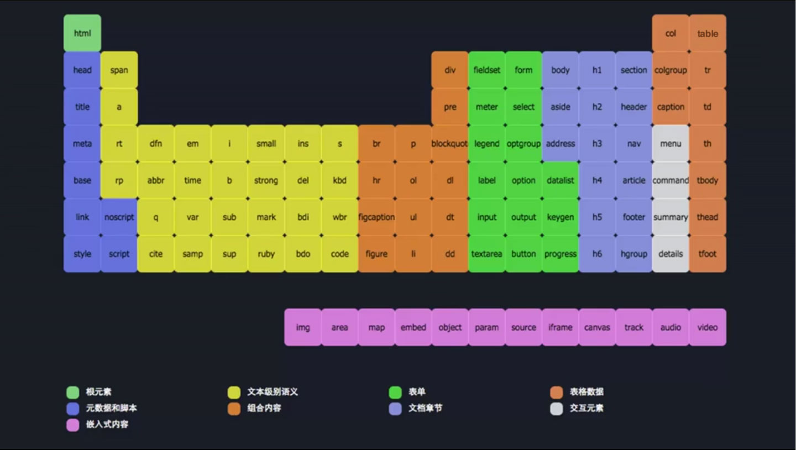

<!-- START doctoc generated TOC please keep comment here to allow auto update -->
<!-- DON'T EDIT THIS SECTION, INSTEAD RE-RUN doctoc TO UPDATE -->
**Table of Contents**  *generated with [DocToc](https://github.com/thlorenz/doctoc)*

- [HTML 标签](#html-%E6%A0%87%E7%AD%BE)
  - [文档章节标签](#%E6%96%87%E6%A1%A3%E7%AB%A0%E8%8A%82%E6%A0%87%E7%AD%BE)
  - [列表标签](#%E5%88%97%E8%A1%A8%E6%A0%87%E7%AD%BE)
  - [表格](#%E8%A1%A8%E6%A0%BC)
  - [表单](#%E8%A1%A8%E5%8D%95)
  - [引用标签](#%E5%BC%95%E7%94%A8%E6%A0%87%E7%AD%BE)
  - [链接标签](#%E9%93%BE%E6%8E%A5%E6%A0%87%E7%AD%BE)
  - [格式化标签](#%E6%A0%BC%E5%BC%8F%E5%8C%96%E6%A0%87%E7%AD%BE)
  - [强调标签](#%E5%BC%BA%E8%B0%83%E6%A0%87%E7%AD%BE)
  - [换行标签](#%E6%8D%A2%E8%A1%8C%E6%A0%87%E7%AD%BE)
  - [嵌入标签](#%E5%B5%8C%E5%85%A5%E6%A0%87%E7%AD%BE)
  - [图标签](#%E5%9B%BE%E6%A0%87%E7%AD%BE)
  - [热点区域标签](#%E7%83%AD%E7%82%B9%E5%8C%BA%E5%9F%9F%E6%A0%87%E7%AD%BE)
  - [语义化](#%E8%AF%AD%E4%B9%89%E5%8C%96)

<!-- END doctoc generated TOC please keep comment here to allow auto update -->

### HTML 标签

**[HTML5 标签集合](http://www.html5star.com/manual/html5label-meaning)**



#### 文档章节标签

`<body>` 页面内容
`<header>` 文档头部
`<nav>` 导航
`<aside>` 侧边栏
`<article>` 定义外部内容（如外部引用的文章）
`<section>` 一个独立的块
`<footer>` 尾部

**页面通常结构**


#### 列表标签

**无序列表**

```html
<ul>
  <li>标题</li>
  <li>结论</li>
</ul>
```

**有序列表**

```html
<ol>
  <li>第一</li>
  <li>第二</li>
</ol>
```

**自定义列表**

```html
<dl>
  <dt>作者</dt>
  <dd>爱因斯坦</dd>
  <dt>作品</dt>
  <dd>《相对论》</dd>
  <dd>《时间与空间》</dd>
</dl>
```

NOTE: `<dl>` 为自定义列表，其中一个`<dl>`可以对应一个或多个 `<dt>`，一个`<dt>`可以对应多个`<dd>`，并且`dt` 与 `dl`列表会有缩进的效果。

#### 表格

**表格代码示例**

```html
<table>
  <caption>table title and/or explanatory text</caption>
  <thead>
    <tr>
      <th>header</th>
    </tr>
  </thead>
  <tbody>
    <tr>
      <td>data</td>
    </tr>
  </tbody>
</table>
```

使用 `colspan` 属性进行跨列，使用 `rowspan` 属性进行跨行。

#### 表单

```html
<form action="WebCreation_submit" method="get" accept-charset="utf-8">
  <fieldset>
    <legend>title or explanatory caption</legend>
    <!-- 第一种添加标签的方法 -->
    <label><input type="text/submit/hidden/button/etc" name="" value=""></label>
    <!-- 第二种添加标签的方法 -->
    <label for="input-id">Sample Label</label>
    <input type="text" id="input-id">
  </fieldset>
  <fieldset>
    <legend>title or explanatory caption</legend>
    <!-- 只读文本框 -->
    <input type="text" readonly>
    <!-- 隐藏文本框，可提交影藏数据 -->
    <input type="text" name="hidden-info" value="hiden-info-value" hidden>
  </fieldset>
  <button type="submit">Submit</button>
  <button type="reset">Reset</button>
</form>
```

使用`fieldset`可用于对表单进行分区

表单中的其他控件类型：
- `textarea` （文本框）
- `select` 与 `option` （下拉菜单可多选）

<table>
  <caption>input 类型支持值列表</caption>
  <tbody>
  <tr>
    <th style="width:22%">Value</th>
    <th>Description</th>
  </tr>
  <tr>
    <td>button</td>
    <td>Defines a clickable button (mostly used with a JavaScript to activate a script)</td>
  </tr>
  <tr>
    <td>checkbox</td>
    <td>Defines a checkbox</td>
  </tr>
  <tr>
  <td class="html5badge">color</td>
    <td>Defines a color picker</td>
  </tr>
  <tr>
  <td class="html5badge">date</td>
    <td>Defines a date control (year, month and day (no time))</td>
  </tr>
  <tr>
  <td class="html5badge">datetime</td>
    <td>The input type datetime has been removed from the HTML standard. Use datetime-local instead.</td>
    </tr>
    <tr>
    <td class="html5badge">datetime-local</td>
      <td>Defines a date and time control (year, month, day, hour, minute, second, and fraction of a second (no time zone)</td>
      </tr>
      <tr>
      <td class="html5badge">email</td>
        <td>Defines a field for an e-mail address</td>
      </tr>
      <tr>
        <td>file</td>
        <td>Defines a file-select field and a "Browse..." button (for file uploads)</td>
      </tr>
      <tr>
        <td>hidden</td>
        <td>Defines a hidden input field</td>
      </tr>
      <tr>
        <td>image</td>
        <td>Defines an image as the submit button</td>
      </tr>
      <tr>
      <td class="html5badge">month</td>
        <td>Defines a month and year control (no time zone)</td>
      </tr>
      <tr>
      <td class="html5badge">number</td>
        <td>Defines a field for entering a number</td>
      </tr>
      <tr>
        <td>password</td>
        <td>Defines a password field (characters are masked)</td>
      </tr>
      <tr>
        <td>radio</td>
        <td>Defines a radio button</td>
      </tr>
      <tr>
      <td class="html5badge">range</td>
        <td>Defines a control for entering a number whose exact value is not important (like a slider control)</td>
      </tr>
      <tr>
        <td>reset</td>
        <td>Defines a reset button (resets all form values to default values)</td>
      </tr>
      <tr>
      <td class="html5badge">search</td>
        <td>Defines a text field for entering a search string</td>
      </tr>
      <tr>
        <td>submit</td>
        <td>Defines a submit button</td>
      </tr>
      <tr>
      <td class="html5badge">tel</td>
        <td>Defines a field for entering a telephone number</td>
      </tr>
      <tr>
        <td>text</td>
        <td>Default. Defines a single-line text field (default width is 20 characters)</td>
      </tr>
      <tr>
      <td class="html5badge">time</td>
        <td>Defines a control for entering a time (no time zone)</td>
      </tr>
      <tr>
      <td class="html5badge">url</td>
        <td>Defines a field for entering a URL</td>
      </tr>
      <tr>
      <td class="html5badge">week</td>
        <td>Defines a week and year control (no time zone)</td>
      </tr>
    </tbody>
</table>

#### 引用标签

- `<cite>` 引用作品的名字、作者的名字等
- `<q>` 引用一小段文字（大段文字引用用`<blockquote>`）
- `<blockquote>` 引用大块文字
- `<pre>` 保存格式化的内容，一般用于引用代码（其空格、换行等格式不会丢失）

`<blockquote>` 拥有 `cite` 属性，它包含引用文本的出处，示例如下所示：

```html
<blockquote cite="http://example.com/facts">
  <p>Sample Quote...</p>
</blockquote>
```

NOTE：`<pre>` 会保留换行和空格，通常与 `<code>` 一同使用。

```html
<pre>
  <code>
    int main(void) {
      printf('Hello, world!');
      return 0;
    }
  </code>
</pre>
```

#### 链接标签

```html
<!-- 默认超链接  -->
<a href="http://sample-link.com" title="Sample Link">Sample</a>
<!-- 当前窗口显示 -->
<a href="http://sample-link.com" title="Sample Link" target="_self">Sample</a>
<!-- 新窗口显示 -->
<a href="http://sample-link.com" title="Sample Link" target="_blacnk">Sample</a>
<!-- iframe 中打开链接 -->
<a href="http://sample-link.com" title="Sample Link" target="iframe-name">Sample</a>
<iframe name="iframe-name" frameborder="0"></iframe>

<!-- 页面中的锚点 -->
<a href="#achor">Achor Point</a>
<section id="achor">Achor Content</section>

<!-- 邮箱及电话需系统支持 -->
<a href="mailto:sample-address@me.com" title="Email">Contact Us</a>
<!-- 多个邮箱地址 -->
<a href="mailto:sample-address@me.com, sample-address0@me.com" title="Email">Contact Us</a>
<!-- 添加抄送，主题和内容 -->
<a href="mailto:sample-address@me.com?cc=admin@me.com&subject=Help&body=sample-body-text" title="Email">Contact Us</a>

<!-- 电话示例 -->
<a href="tel:99999999" title="Phone">Ring Us</a>
```

#### 格式化标签

`<b>` 加粗     
`<i>` 斜体

#### 强调标签

`<em>` 斜体。着重于强调内容，会改变语义的强调    
`<strong>` 粗体。着重于强调内容的重要性

#### 换行标签

`<br>` 换行

#### 嵌入标签

```html
<iframe src=""></iframe> 页面操作可以不影响到iframe的内容

<!--object embed通常用来嵌入外部资源 -->
<object type="application/x-shockwave-player">
  <param name="movie" value="book.pdf">
</object>

<!--视频 track可以引入字幕 autoplay可以使视频加载后自动播放，loop可以使其循环播放 -->
<video autoplay loop controls="controls" poster="poster.jpg">
  <source src="movie.mp4" type="video/mp4">
  <source src="movie.webm" type="video/webm">
  <source src="movie.ogg" type="video/ogg">
  <track kind="subtitles" src="video.vtt" srclang="cn" label="cn">
</video>
```

#### 图标签
`canvas` 基于像素，性能要求比较高，可用于实时数据展示。`svg` 为矢量图形图像。

#### 热点区域标签

`img`中套用`map`以及`area`可以实现点击某部分图片触发一个链接，点击另一部分触发另一个链接

```html

<map name="map">
    <area shap="rect" coords="0,0,50,50" href="" alt="">
    <area shap="circle" coords="75,75,25" href="" alt="">
</map>
```

#### 语义化

语义化（Semantic Tag）是指用合适的标签标识适当的内容，它可以起到搜索引擎优化（Search Engine Optimization），提高可访问性（例如盲人使用的屏幕阅读器），与此同时还可以提高代码的可读性。简而言之也就是**在正确的地方使用正确的标签**
