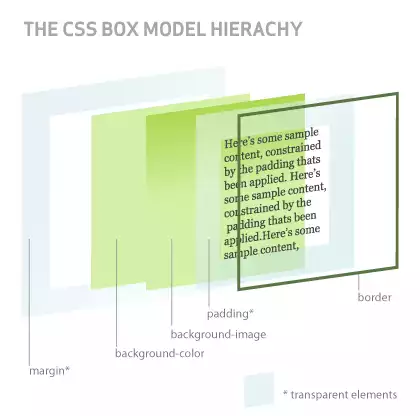
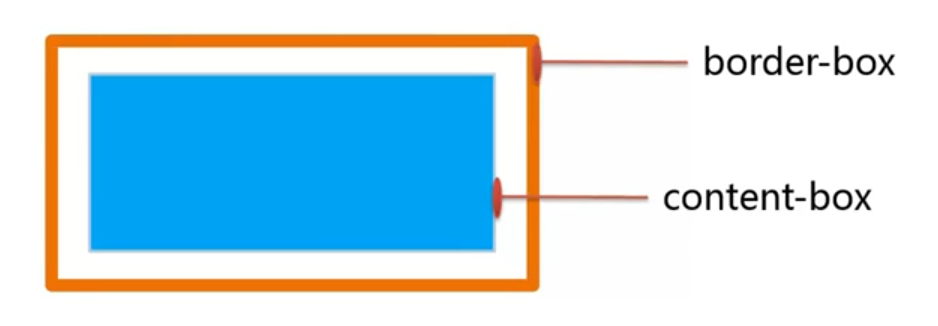
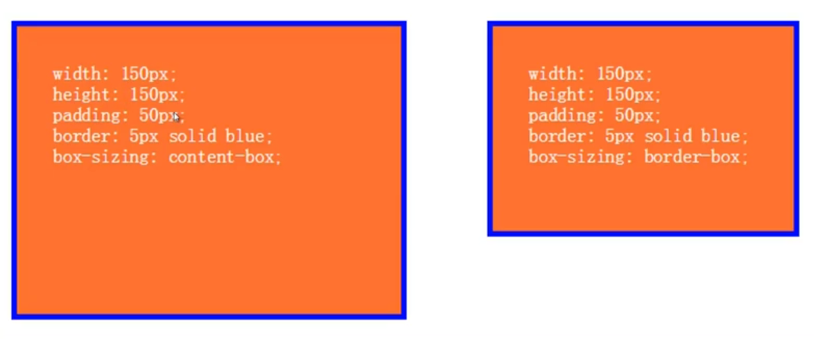
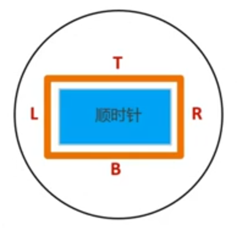

<!-- START doctoc generated TOC please keep comment here to allow auto update -->
<!-- DON'T EDIT THIS SECTION, INSTEAD RE-RUN doctoc TO UPDATE -->
**Table of Contents**  *generated with [DocToc](https://github.com/thlorenz/doctoc)*

- [盒模型](#%E7%9B%92%E6%A8%A1%E5%9E%8B)
  - [属性](#%E5%B1%9E%E6%80%A7)
    - [width](#width)
    - [height](#height)
    - [padding](#padding)
    - [margin](#margin)
    - [border](#border)
    - [border-radius](#border-radius)
    - [overflow](#overflow)
    - [box-sizing](#box-sizing)
    - [box-shadow](#box-shadow)
    - [outline](#outline)
  - [TRBL](#trbl)
  - [值缩写](#%E5%80%BC%E7%BC%A9%E5%86%99)

<!-- END doctoc generated TOC please keep comment here to allow auto update -->

<!-- MarkdownTOC -->

- [盒模型](#盒模型)
	- [属性](#属性)
		- [width](#width)
		- [height](#height)
		- [padding](#padding)
		- [margin](#margin)
		- [border](#border)
		- [border-radius](#border-radius)
		- [overflow](#overflow)
		- [box-sizing](#box-sizing)
		- [box-shadow](#box-shadow)
		- [outline](#outline)
	- [TRBL](#trbl)
	- [值缩写](#值缩写)

<!-- /MarkdownTOC -->

### 盒模型

盒子模型是网页布局的基石。它有**边框**、**外边距**、**内边距**、**内容**组成。

**盒子 3D 模型**



盒子由上到下依次分为五层，它们自上而下的顺序是。

1. border 边框
2. content + padding 内容与内边距
3. background-image 背景图片
4. background-color 背景颜色
4. margin 外边距

#### 属性


##### width

**内容盒子宽**

`width: <length> | <percentage> | auto | inherit`

NOTE：通常情况下百分比得参照物为元素的父元素。`max-width` 与 `min-width` 可以设置最大与最小宽度。

##### height

**内容盒子高**

`height: <length> | <percentage> | auto | inherit`

NOTE：默认情况元素的高度为内容高度。`max-height` 与 `min-height` 可以设置最大与最小高度。

##### padding


`padding: [<length> | <percentage>]{1,4} | inherit`

##### margin


`margin: [<length> | <percentage> | auto]{1,4} | inherit`

NOTE：`margin` 默认值为 `auto`

Trick：

```
/* 可用于水平居中 */
margin: 0 auto;
```

###### margin 合并


毗邻元素外间距（margin）会合并，既取相对较大的值。父元素与第一个和最后一个子元素的外间距也可合并。

NOTE：margin合并只存在于垂直方向上，margin在水平方向上是不会发生合并的。

##### border

**统一设置所有边框**


```
border: [<br-width> || <br-style> || <color>] | inherit
border-width: [<length> | thin | medium | thick]{1,4} | inherit
border-style: [solid | dashed | dotted | ...]{1,4} |inherit
border-colro: [<color> | transparent]{1,4} | inherit
```

NOTE：`border-color` 默认为元素字体颜色。

`border : 1px dashed blue; `

```html
border-width: 0 1px 2px 3px;
border-style: solid;
border-color: #0ff;
```

**单独设置每条边框**

```
border-left: [<br-width> || <br-style> || <color>] | inherit
border-left-width: [<length> | thin | medium | thick]{1,4} | inherit
border-left-style: [solid | dashed | dotted | ...]{1,4} |inherit
border-left-colro: [<color> | transparent]{1,4} | inherit
```

上面的可以设置左边border，类似的也可以设置border-right、border-top、border-bottom。

##### border-radius


`border-radius : [<length> | <percentage>]{1,4} [/[<length> | <percentage>]{1,4}?`

最多可以设置8个[length|percentage]，第一个[length|percentage]组的4个值分别代表左上到左下（顺时针）角水平半径大小，第二个[length|percentage]组的4个值分别代表左上到左下（顺时针）角垂直半径大小。其取值符合TRBL原则

NOTE：8个取值先匹配水平方向的，再匹配垂直方向的。如果垂直方向没有值，那么垂直方向与水平方向的设置相同。

```
border-radius : 10px;  //四个角水平和垂直半径都是10px
//左上右下水平半径为10px，左下右上水平半径为20px。垂直方向与水平方向一样
border-radius : 10px 20px;  
//左上水平半径10px，右上水平半径20px，右下水平半径30px，左下水平半径20px。垂直方向与水平方向一样
border-radius : 10px 20px 30px;  
```

```html
border-radius : 50%;  //画出的是一个正圆
border-radius : 0px 5px 10px 15px / 20px 15px 10px 5px;
//左上角水平半径0px、垂直半径20px
//右上角 5px 15px
//右下角 10px 10px
//左下角 15px 5px
```

##### overflow


`overflow: visible（默认值） | hidden | scroll | auto`

- visible ：超出部分依然显示
- hidden ：超出部分隐藏
- scroll ：无论什么时候都显示滚动条
- auto ：没超出的时候不显示滚动条，超出的时候显示滚动条

NOTE：使用 `overflow-x` 与 `overflow-y` 单独的设置水平和垂直方向的滚动条。

##### box-sizing

`box-sizing：content-box（默认值） | border-box | inherit`

指定width和height属性设置的对象是border box还是content box。

- 如果是`content-box`，那么盒子大小 = 内容盒子宽高 + 填充（`Padding`）+ 边框宽（`border-width`）
- 如果是`border-box`，那么盒子大小 = 内容盒子宽高





##### box-shadow


`box-shadow : none | <shadow> [,<shadow>]*`

`<shadow> : inset ? && <length>{2,4} && <color>?`

`inset`表示是否要是内阴影，默认是外阴影
`<length>{2,4}` 2-4个阴影分别表示水平偏移、垂直偏移、模糊半径、阴影大小

```html
box-shadow : 4px 6px 3px 5px red;  
//4px表示水平偏移
//6px表示垂直偏移
//3px表示模糊半径（可选）
//5px表示阴影大小（可选）
box-shadow : inset 0px 0px 5px red;
//inset表示是内阴影，没加inset则默认是外阴影。
```

NOTE：水平与垂直偏移可以为负值即相反方向偏移。颜色默认为文字颜色。阴影不占据空间，仅为修饰效果。

##### outline

```
outline: [ <'outline-color'> || <'outline-style'> || <'outline-width'> ]
outline-width: <length> | thin | medium | thick | inherit
outline-style: solid | dashed | dotted | ... | inherit
outline-color: <color> | invert | inherit
/* invert 与当前颜色取反色 */
```

NOTE：`outline` 与 `border` 相似但无法分别设置四个方向的属性。`outline` 并不占据空间，而 `border` 占据空间，且显示位于 `border` 以外。

#### TRBL




TRBL (Top, Right, Bottom, Left) 即为顺时针从顶部开始。具有四个方向的属性都可以通过 `*-top` `*-right` `*-bottom` 与 `*-left` 单独对其进行设置。

#### 值缩写

下面的值缩写以 `padding` 为例。

> 对面相等，后者省略；四面相等，只设一个。

```html
/*      四面值 */
padding: 20px;
padding: 20px 20px 20px 20px;

/*      上下值 右左值 */
padding: 20px   10px;
padding: 20px 10px 20px 10px;

/*       上值 右左值 下值 */
padding: 20px 10px   30px;
padding: 20px 10px 30px 10px;
```
