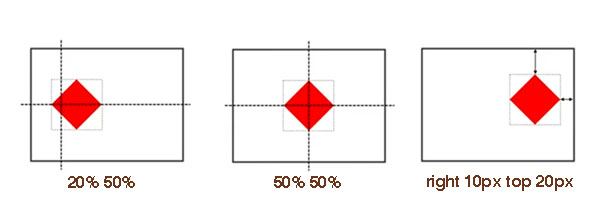
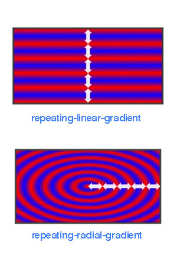
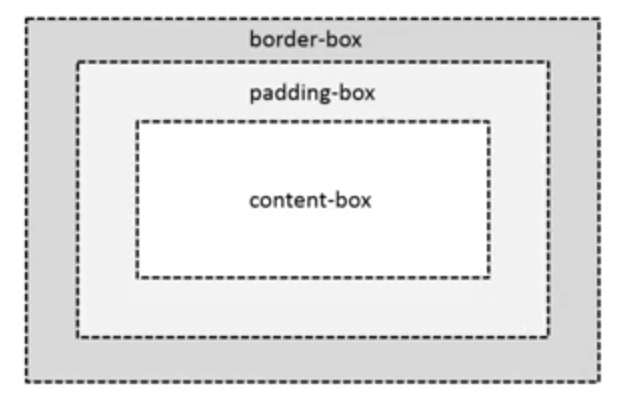
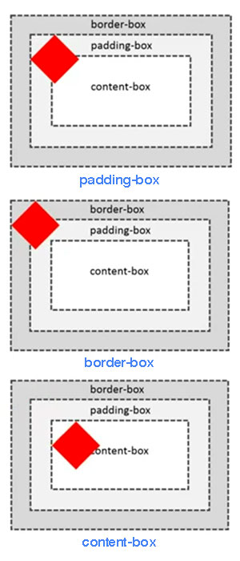
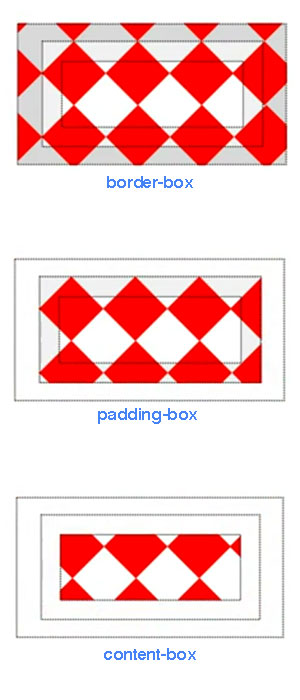
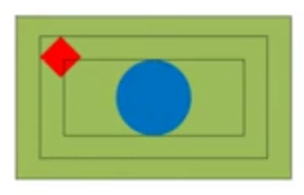

<!-- START doctoc generated TOC please keep comment here to allow auto update -->
<!-- DON'T EDIT THIS SECTION, INSTEAD RE-RUN doctoc TO UPDATE -->
**Table of Contents**  *generated with [DocToc](https://github.com/thlorenz/doctoc)*

- [背景](#%E8%83%8C%E6%99%AF)
  - [background-color](#background-color)
  - [background-image](#background-image)
  - [background-repeat](#background-repeat)
  - [background-attachment](#background-attachment)
  - [background-position](#background-position)
    - [Sprite 的使用](#sprite-%E7%9A%84%E4%BD%BF%E7%94%A8)
  - [linear-gradient](#linear-gradient)
  - [radial-gradient](#radial-gradient)
  - [repeat-*-gradient](#repeat--gradient)
  - [background-origin](#background-origin)
  - [background-clip](#background-clip)
  - [background-origin && background-clip](#background-origin-&&-background-clip)
  - [background-size](#background-size)
  - [background shorthand](#background-shorthand)

<!-- END doctoc generated TOC please keep comment here to allow auto update -->

### 背景

#### background-color

```
background-color: <color>
background-color: #f00;
background-color: rgba(255, 0, 0, 0.5);
background-color: transparent; /* 默认值 */
```

NOTE：rgba和opacity都能实现透明效果，但最大的不同是opacity作用于元素，以及元素内的所有内容的透明度，而rgba只作用于元素的颜色或其背景色 。

#### background-image

```
background-image: <bg-image>[, <bg-image>]*
/* <bg-image> = <image> | none */
background-image: url("../image/pic.png");
background-image: url("../image/pic.png0"), url("../image/pic1.png");
/* 多张背景图时，先引入的图片在上一层后引入则在下一层 */
```

NOTE：当`background-color` 与 `background-image` 共存时，背景颜色永远在最底层（于背景图片之下）。

#### background-repeat

`background-repeat` 需与背景图片数量一致。

```
background-repeat: <repeat-style>[, <repeat-style]*
<repeat-style> = repeat-x | repeat-y | [repeat | space | round | no-repeat]{1,2}

/*                   X 轴     Y 轴 */
background-repeat: no-repeat repeat;
```

- `repeat-x` 沿X轴平铺
- `repeat-y` 沿Y轴平铺
- `repeat` 沿X、Y轴平铺
- `space` 平铺并在水平和垂直留有空隙。空隙的大小为图片均匀分布后完整覆盖显示区域后剩下的宽高
- `round` 不留空隙平铺且覆盖显示区域，图标会被缩放以达到覆盖效果（缩放不一定等比）
- `no-repeat` 不平铺

当取两个值时，第一个值表示X轴的平铺方式，第二个值表示Y轴的平铺方式。

```
/*                   X 轴     Y 轴 */
background-repeat: no-repeat repeat;
```
当有多张背景图片时，background-repeat的值先给前面的背景图片使用，当后面的背景图片没有对应的background-repeat值时，其平铺方式与最后一张背景图相同。

```html
/* red.png的平铺方式为X轴不平铺，Y轴平铺
   blue.png没有对应的background-repeat值
   因此其与red.png一样，X轴不平铺，Y轴平铺 */
background-image:url(red.png), url(blue.png)
background-repeat:no-repeat repeat;
```

#### background-attachment

MARK：background-attachment只适合用在html和body上，这个属性的兼容性是有问题的。

`background-attachmeng : <attachment> [, <attachment>]*`

`<attachmengt> = scroll（默认值） | fixed | local`

当页面内容超过显示区域时，使用 `local` 使背景图片同页面内容一同滚动。

- `scroll` 默认值，不随着滚动- 
- `local` 随着内容滚动
- `fixed` 几乎不用

#### background-position

```
background-position: <position>[, <position>]*   
<position> = [left|center|right|top|bottom|<percentage>|<length>]|      //第1行 
[left|center|right| <percentage>|<length>] [top | center | bottom | <percentage>| <length>] |      //第2行
[center |[left|right][<percentage>|<length>]?] && [center |[left|right][<percentage>|<length>]?] //第3行
```   

- 第1行，可以写1个值。这时如果是top或者bottom，那么表示就是Y轴的位置。如果是`left/center/right/pertentage/length`，那么表示的就是X轴的位置。这时候另外一个轴的位置都默认居中。

```css
background-position: top;  <!-- Y轴居上对齐，X轴居中 -->
background-position: left;  <!-- X轴左对齐，Y轴居中 -->
background-position: 30%;  <!-- X轴在30%的位置，Y轴居中 -->
background-position: 15px; <!-- X轴偏移15px，Y轴居中 -->
```

- 第2行，可以写2个值。第一个值为X轴偏移量位置（偏移量），第二个值为Y轴位置（偏移量），偏移量默认以左边和上边为参考线。

```css
/* 默认位置为 */
background-position: 0 0;
background-position: 10px 20px;  
background-position: 30% 50%;  <!-- X轴距离左边30%，Y轴距离上边50%（居中） -->
background-position: left top;  <--X轴左对齐，Y轴上对齐 -->
```

- 第3行，可以写4个值。前两个值表示X轴信息，后两个值表示Y轴信息。此时，两个值中第一个值表示参照方向，第二个值表示距离。

```css
/* 四个值时方向只为参照物 */
background-position: right 10px top 20px; //距离右边10px，距离上边20px
```



```
/* 默认位置为 */
background-position: 0 0;

/* percentage 是容器与图片的百分比重合之处*/
background-position: 20% 50%;

/* 等同效果 */
background-position: 50% 50%;
background-position: center center;

background-position: 0 0;
background-position: left top;

background-position: 100% 100%;
background-position: right bottom;

/* 四个值时方向只为参照物 */
background-position: right 10px top 20px;
```

##### Sprite 的使用

```html
background-image: url(sprite.png)
background-repeat: no-repeat;
background-positon: 0 -100px
```

使用位置为负值将图片偏移使需要的图片位置上移并显示正确的图案。

#### linear-gradient

`linear-gradient(   [[<angle> | to <side-or-corner>],]? <color-stop>[, <color-stop>]+`    
`<side-or-corner> = [left | right] || [top | bottom]`   
`<color-stop> = <color> [<percentage> | <length>]?  )`   

- `[[<angle> | to <side-or-corner>],]?,` 表示方向可有可无。没有值的时候，表示默认从上到下。**当值为角度时，默认是0°，即从下到上，旋转方向是顺时针。**   

- `<color-stop>[, <color-stop>]+` 表示颜色至少要有两个

```css
background-image: linear-gradient(red, blue); //从上到下
background-image: linear-gradient(to top, red, blue); //从下到上
background-image: linear-gradient(to right bottom, red, blue); //从左上到右下
background-image: linear-gradient(0deg, red, blue); //0度，即从下往上
background-image: linear-gradient(45deg, red, blue); //45度，即左下到右上
background-image: linear-gradient(red, green, blue); 
background-image: linear-gradient(red, green 20%, blue); //0-20%为红到绿，20%-100%为绿到蓝 
```


#### radial-gradient

```
radial-gradient(   [ circle || <length> ] [ at <position> ]? , |    
[ ellipse || [<length> | <percentage> ]{2}] [ at <position> ]? , |   
[ [ circle | ellipse ] || <extent-keyword> ] [ at <position> ]? , |    
at <position> ,    
<color-stop> [ , <color-stop> ]+ )
```

`<extent-keyword> = closest-corner | closest-side | farthest-corner | farthest-side`
`<color-stop> = <color> [ <percentage> | <length> ] )?`

- 第1行，设置为圆形，圆心半径大小，以及圆心位置

```css
/* 圆，半径100px，原点位置为0,0，从红到蓝渐变 */
background-image: radial-gradient(circle 100px at 0 0, red, blue);
```

- 第2行，设置为椭圆，并设置半径大小，以及圆心位置

```css
/* 椭圆，半径X轴100px，Y轴半径200px，圆心在原点（左上角），从红到蓝渐变 */
background-image: radial-gradient(ellipse 100px 200px at 0 0, red, blue);
```

- 第3行，设置为圆形或椭圆，设置关键字(?????有问题MARK)

- `closet-side` 离圆心最近的那条边
- `farthest-side` 离圆心最远的那条边
- `closet-corner` 离圆心最近的那个角
- `farthest-corner` 离圆心最远的那个角

- 第4行，不设置形状和半径

```css
background-image: radial-gradient(cloest-side, red, blue);
background-image: radial-gradient(circle, red, blue); //此时为farthest-corner 
background-image: radial-gradient(circle 100px, red, blue);
background-image: radial-gradient(red, blue);
background-image: radial-gradient(100px 50px, red, blue); //X半径100px，Y半径50px
background-image: radial-gradient(100px 50px at 0 0, red, blue); //圆心定位在(0, 0)
background-image: radial-gradient(red, green 20%, blue);
```


#### repeat-*-gradient

```
background-image: repeating-linear-gradient(red, blue 20px, red 40px);
background-image: repeating-radial-gradient(red, blue 20px, red 40px);
```



#### background-origin

**案例模型**



`<box>[, <box>]*`   
`<box> = border-box | padding-box | content-box`

决定背景 (0,0) 坐标与 100% 坐标的区域。默认值为 `padding-box`。

- `padding-box` （默认值）背景坐标与padding-box坐标重合
- `border-box` 背景坐标与border-box坐标重合
- `content-box` 背景坐标与content-box坐标重合

```
background-image: url(red.png);
background-repeat: no-repeat;

background-origin: padding-box;
background-origin: border-box;
background-origin: content-box;
```



#### background-clip

`<box>[, <box>]*`   
`<box> = border-box | padding-box | content-box`

裁剪背景。

- `border-box` 默认值。在border box的外延裁剪
- `padding-box` 在padding box的外延裁剪
- `content-box` 在content box的外延裁剪

```
background-image: url(red.png);
background-repeat: no-repeat;

background-clip: border-box;
background-clip: padding-box;
background-clip: content-box;
```



#### background-origin && background-clip

两者的值都是取：border-box/padding-box/content-box，但是background-origin确定的是背景的原点位置，然后以这个位置为标准去放置背景并平铺（如果需要平铺的话）。而background-clip确定的是从哪儿开始去裁剪掉背景。这两个应该是相互协助的功能。具体例子有待补充（MARK）

#### background-size

`<bg-size>[, <bg-size>]*`   
`<bg-size> = [<length> | <percentage> | auto（默认值）] {1, 2} | cover | contain`   

改变背景大小。

- `length` 固定大小
- `percentage` 相对于容器的百分比大小
- `auto` 自动（默认值）
- `cover` 尽可能小，但其宽或高都不能小于容器对应的边
- `contain`  尽可能大，但宽或高都不能大于容器对应的边

```
background-image: url(red.png);
background-repeat: no-repeat;
background-position: 50% 50%;

background-size: auto;
background-size: 20px 20px;
/* % 参照物为容器*/
background-size: 50% 50%;
/* 尽可能小，但宽度与高度不小过容器（充满容器） */
background-size: cover;
/* 尽可能大，但宽度与高度不超过容器（最大完全显示）*/
background-size: contain;
```


#### background shorthand

`[<bg-layer,]* <final-bg-layer>`   
`<bg-layer> = <bg-image> || <position> [/ <bg-size>]? || <repeat-style> || <attachment> || <box> || <box>`    
`<final-bg-layer> = <bg-layer> || <'background-color'>`   

- 只出现一个 box。则是 background-origin 也是 background-clip
- 出现两个 box。第一个为 background-origin，第二个为 background-clip

```
background: url(red.png) 0 0/20px 20px no-repeat, url(blue.png) 50% 50%/contain no-repeat content-box green;
```


