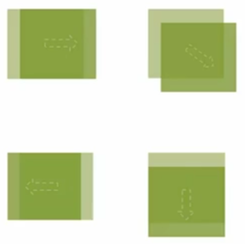
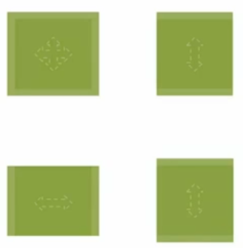
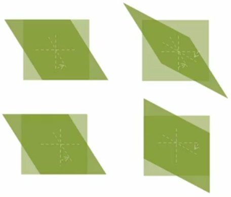
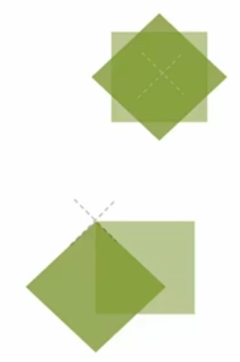
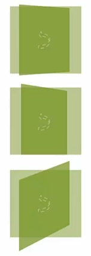
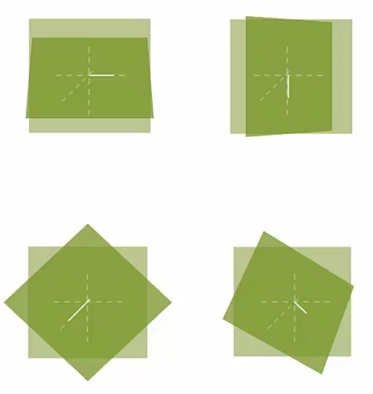

<!-- START doctoc generated TOC please keep comment here to allow auto update -->
<!-- DON'T EDIT THIS SECTION, INSTEAD RE-RUN doctoc TO UPDATE -->
**Table of Contents**  *generated with [DocToc](https://github.com/thlorenz/doctoc)*

- [变形](#%E5%8F%98%E5%BD%A2)
  - [2D 变形](#2d-%E5%8F%98%E5%BD%A2)
    - [translate() 偏移](#translate-%E5%81%8F%E7%A7%BB)
  - [3D 变形](#3d-%E5%8F%98%E5%BD%A2)
    - [perspective  设置旋转透视效果](#perspective--%E8%AE%BE%E7%BD%AE%E6%97%8B%E8%BD%AC%E9%80%8F%E8%A7%86%E6%95%88%E6%9E%9C)
    - [perspective-origin  设置旋转透视角度](#perspective-origin--%E8%AE%BE%E7%BD%AE%E6%97%8B%E8%BD%AC%E9%80%8F%E8%A7%86%E8%A7%92%E5%BA%A6)
    - [transform-style  保留3D空间](#transform-style--%E4%BF%9D%E7%95%993d%E7%A9%BA%E9%97%B4)
    - [backface-visibility  设置背面是否可见](#backface-visibility--%E8%AE%BE%E7%BD%AE%E8%83%8C%E9%9D%A2%E6%98%AF%E5%90%A6%E5%8F%AF%E8%A7%81)
    - [rotateY()  沿Y轴旋转](#rotatey--%E6%B2%BFy%E8%BD%B4%E6%97%8B%E8%BD%AC)
    - [rotate3d()  3D旋转](#rotate3d--3d%E6%97%8B%E8%BD%AC)
    - [translate3d()  3D偏移](#translate3d--3d%E5%81%8F%E7%A7%BB)
    - [scale3d()  3D缩放](#scale3d--3d%E7%BC%A9%E6%94%BE)

<!-- END doctoc generated TOC please keep comment here to allow auto update -->

### 变形

#### 2D 变形

###### rotate() 旋转

`rotate(<angle>)` 

旋转一个元素（**参照物：Y轴，顺时针为正方向**）

```
rotate(45deg);
<!-- 右边旋转，顺时针 -->
rotate(-60deg);
<!-- 左边旋转，逆时针 -->
```


##### translate() 偏移

`translate(<translation-value>[, <translation-value>]?)`

移动一个元素（**参照物：从左到右，从上到下为正方向**）

- 两个参数分别代表 X 与 Y 轴的移动（偏移值均可为负值）
- 当只有一个值的时候，另外一个值相当于没设置。

也可单独设置 X 与 Y 轴的偏移：

`translationX(<translation-value>)`  只设置X轴的偏移

`translationY(<translation-value>)`  只设置Y轴的偏移

```
transform: translate(50px);
transform: translate(50px, 20%);  <!-- 20%的参照物为盒子本身的高 -->
transform: translate(-50px);
transform: translate(20%);
```


###### scale() 缩放

`scale(<number> [, <number>]?)`

缩放一个元素。

- 两个参数分别代表 X 与 Y 轴的缩放（缩放值均可为负值）
- 只有一个参数时，第二个参数的值与第一个参数相同。

也可单独设置 X 与 Y 轴的缩放：

`scaleX(<number>)`   
`scaleY(<number>)`

```
<!-- 整体放大 1.2 倍 -->
transform: scale(1.2);
<!-- 高度拉伸 -->
transform: scale(1, 1.2);
<!-- 宽度拉伸 -->
transform: scaleX(1.2);
<!-- 高度拉伸 -->
transform: scaleY(1.2);
```


###### skew() 倾斜

`skew(<angle>[, <angle>]?)`

倾斜一个元素，倾斜值可为负值。(**参照物：第一个值，Y往X逆时针为正。第二个值，X往Y顺时针为正**)

- 参数2个时，分别代表Y轴倾斜和X轴倾斜。
- 参数1个时，代表Y轴倾斜，X轴默认是0倾斜度。

也可单独设置 X 与 Y 轴的倾斜：

`skewX(<angle>)`  <!-- 向X轴倾斜 -->
`skewY(<angle>)`  <!-- 向Y轴倾斜 -->
 
```
transform: skew(30deg);
transform: skew(30deg, 30deg);
transform: skewX(30deg);
transform: skewY(30deg);
```



###### transform-origin 设置旋转原点位置

`transform-origin: [ <percentage> | <length> | left | center | right | top | bottom] | [ [ <percentage> | <length> | left | center | right ] && [ <percentage> | <length> | top | center | bottom ] ] <length>?`

其用于设置原点的位置（默认位置为元素中心）第一值为 X 方向，第二值为 Y 方向， 第三值为 Z 方向。（当值空出未写的情况下默认为 50%）

```
transform-origin: 50% 50%; /* 原点在中心点 */
transform-origin: 0 0; 	/* 原点在容器左上角 */
transform-origin: right 50px 20px;  /* 原点在最右边，往Y轴偏了50px，Z轴偏了20px */
transform-origin: top right 20px;  
```


###### transform shorthand

`trnasform: none（默认值） | <transform-function>+`

`<transform-function> : rotate | translate | scale | skew `

使一个元素变形。这里的`<transform-function>`指的就是具体的变形方法：

- rotate 旋转
- translate 偏移
- scale 缩放
- skew 倾斜

变形函数顺序普通会导致结果不同，如下面这个例子：

```
<!-- 下面两个的结果是不同的 -->
<!-- 先偏移50%，再旋转45° -->
transform: translate(50%) rotate(45deg);
<!-- 先旋转45%，再偏移50% -->
transform: rotate(45deg) transform(50%)
```

之所以这样，是因为当发生变形的时候，其X轴和Y轴也跟着发生了变化。在上面第二个例子中，当先旋转45%的时候，X轴和Y轴都向顺时针方向偏移了45度。此时再偏移50%，则是向旋转之后的X轴方向偏转。


#### 3D 变形

##### perspective  设置旋转透视效果

`perspective: none | <length>`

设置图片 Y 轴旋转后的透视效果。`<length>` 可以理解为人眼与元素之间的距离，越紧则效果越明显。

```
perspective: none;
perspective: 2000px;
perspective: 500px;
```


##### perspective-origin  设置旋转透视角度

`perspective-origin: [ <percentage> | <length> | left | center | right | top | bottom] |    [ [ <percentage> | <length> | left | center | right ] && [ <percentage> | <length> | top | center | bottom ] ]`

设置旋转透视角度，透视位置均可设定为负值。

- 1个值时，设置的是X轴上的位置，Y轴上的位置默认为center
- 2个值时，设置的是X、Y轴上的位置

```
perspective-origin: 50% 50%; <!-- 在正前方透视 -->
perspective-origin: left bottom; <!-- 在左下方透视 -->
perspective-origin: 50% -800px; <!-- 在正上方透视 -->
perspective-origin: right;	<!-- 在右边正中透视 -->
```



##### transform-style  保留3D空间

`transform-style: flat（默认值） | perserve-3d`

设置保留内部的 3D 空间，在需要显示3D效果元素的容器（即父级）元素上设置。

- flat：不保留3D空间
- preserve-3d：保留3D空间

```
transform-style: flat;
transform-style: preserve-3d;
```


##### backface-visibility  设置背面是否可见

`backface-visibility: visible | hidden`

设置元素背面不可见，即元素通过3D操作之后不显示元素背面。

```
backface-visibility: visible;
backface-visibility: hidden;
```


##### rotateY()  沿Y轴旋转

`transform: rotateY(<angle>)`

设置元素沿Y轴旋转

##### rotate3d()  3D旋转

`rotate3d(<number>, <number>, <number>, <angle>)`

对元素进行3D旋转。旋转方式为：取 X Y Z 三轴上的一点并于坐标原点连线，以连线为轴进行旋转（逆时针）。

也可以单独设置元素在各个轴上的旋转角度：

`rotateX(<angle>)`
`rotateY(<angle>)`
`rotateZ(<angle>)`

```
<!-- 下面等同于 X 轴旋转 -->
transform: rotate3d(1, 0, 0, 45deg);
<!-- 下面等同于 Y 轴旋转 -->
transform: rotate3d(0, 1, 0, 45deg);
<!-- 下面等同于 Z 轴旋转（等同于2D 旋转） -->
transform: rotate3d(0, 0, 1, 45deg);
<!-- 以(1, 1, 1)和原点之间的连线旋转 -->
transform: rotate3d(1, 1, 1, 45deg);
```


##### translate3d()  3D偏移

`translate3d(<translate-value>, <translate-value>, <length>)`

`<translate-value> : <length> | <percentage>`

在3D平面进行偏移。也可以只偏移某一个方向：

`translateX(<translate-value>)`
`translateY(<translate-value>)`
`translateZ(<length>)`

```
<!-- 20%的参照物为自身元素 -->
transform: translate3d(10px, 20%, 50px);
transform: translateX(10px);
transform: translateY(20%);
transform: translateZ(-100px);
```


##### scale3d()  3D缩放

`scale3d(<number>, <number>, <number>)`

对元素进行3D缩放。也可以单独设置元素在各个轴上的缩放倍数：

`scaleX(<number>)`
`scaleY(<number>)`
`scaleZ(<number>)`

```
transform: scale3d(1.2, 1.2, 1);
transform: scale3d(1, 1.2, 1);
transform: scale3d(1.2, 1, 1);
transform: scaleZ(5);
<!-- Z 轴的缩放扩大并不影响盒子大小 -->
```

