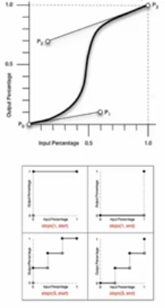

<!-- START doctoc generated TOC please keep comment here to allow auto update -->
<!-- DON'T EDIT THIS SECTION, INSTEAD RE-RUN doctoc TO UPDATE -->
**Table of Contents**  *generated with [DocToc](https://github.com/thlorenz/doctoc)*

- [动画](#%E5%8A%A8%E7%94%BB)
  - [transition](#transition)
    - [transition-property 过渡属性](#transition-property-%E8%BF%87%E6%B8%A1%E5%B1%9E%E6%80%A7)
    - [transition-duration 过渡时间](#transition-duration-%E8%BF%87%E6%B8%A1%E6%97%B6%E9%97%B4)
    - [transition-delay 延迟时间](#transition-delay-%E5%BB%B6%E8%BF%9F%E6%97%B6%E9%97%B4)
    - [transition-timing-function 过渡时间函数](#transition-timing-function-%E8%BF%87%E6%B8%A1%E6%97%B6%E9%97%B4%E5%87%BD%E6%95%B0)
    - [transition shorthand](#transition-shorthand)
  - [animation](#animation)
    - [animation-name 动画名](#animation-name-%E5%8A%A8%E7%94%BB%E5%90%8D)
    - [animation-duration 执行时间](#animation-duration-%E6%89%A7%E8%A1%8C%E6%97%B6%E9%97%B4)
    - [animation-delay 延迟时间](#animation-delay-%E5%BB%B6%E8%BF%9F%E6%97%B6%E9%97%B4)
    - [animation-timing-function 过渡时间函数](#animation-timing-function-%E8%BF%87%E6%B8%A1%E6%97%B6%E9%97%B4%E5%87%BD%E6%95%B0)
    - [animation-iteration-count 执行次数](#animation-iteration-count-%E6%89%A7%E8%A1%8C%E6%AC%A1%E6%95%B0)
    - [animation-direction 运动方向](#animation-direction-%E8%BF%90%E5%8A%A8%E6%96%B9%E5%90%91)
    - [animation-play-state 播放状态](#animation-play-state-%E6%92%AD%E6%94%BE%E7%8A%B6%E6%80%81)
    - [animation-fill-mode 首末状态](#animation-fill-mode-%E9%A6%96%E6%9C%AB%E7%8A%B6%E6%80%81)
    - [animation shorthand](#animation-shorthand)
    - [@keyframes 关键帧](#@keyframes-%E5%85%B3%E9%94%AE%E5%B8%A7)

<!-- END doctoc generated TOC please keep comment here to allow auto update -->

### 动画

#### transition 

##### transition-property 过渡属性

`transition-property: none | <single-traisition-property> [ ',' <single-transition-property>]*`

`<single-transition-property> = all（默认值）| <IDENT>`

设置对哪些属性执行过渡效果。`<INDENT>`表示对哪个属性做过渡效果，如：`left`（对left属性做过渡效果） `all`（对所有属性做过渡效果）……

```
<!-- 不对任何属性执行过渡效果 -->
transition-property: none;
<!-- 对所有属性都执行过渡效果 -->
transition-property: all;
<!-- 对left属性执行过渡效果 -->
transition-property: left;
transition-property: left, color;
```

##### transition-duration 过渡时间

`transition-duration: <time>[, <time>]*`

过渡效果执行的时间，即动画总共执行的时间。

```
transition-duration: 0s;
transition-duration: 1s;
transition-duration: 1s, 2s, 3s;
```

##### transition-delay 延迟时间 

`transition-delay: <time>[,<time>]*`

设置过渡延迟的时间，即过多久之后才执行动画。

```
transition-delay: 0s;
transition-delay: 1s;
transition-delay: 1s, 2s, 3s;
```

##### transition-timing-function 过渡时间函数 

`transition-timing-function: <single-transition-timing-function>[',' <single-transition-timing-function>]*`

`<single-transition-timing-function> = ease（默认） | linear | ease-in | ease-out | ease-in-out | cubic-bezier(<number>,<number>,<number>,<number>) | step-start | step-end | steps(<integer>)[, [start | end]]?)`

定义过渡的时间函数，可以改变过渡的速率。

- ease：两头慢，中间快
- linear：匀速
- ease-in：开始的时候慢
- ease-out：结束的时候慢
- ease-in-out：开始、结束的时候慢，与`ease`的区别是这个属性的幅度更大一些
- cubic-bezier(<number>,<number>,<number>,<number>) 自定义设置速率，前两个值为图片右下角点的坐标，后两个值为图片左上角的坐标。
- steps(<integer>) 分integer几步完成整个动画过渡效果



```
<!-- 对于 cubic-bezier 的曲线，前两个值为 P1 的坐标，后两值为 P2 的坐标 -->
transition-timing-function: ease;
transition-timing-function: cubic-bezier(0.25, 0.1, 0.25, 1);
transition-timing-function: linear;
transition-timing-function: cubic-bezier(0, 0, 1, 1);
```

##### transition shorthand

`transition: <single-transition> [',' <single-transition>]*`

`<single-transition> = [none | <single-transition-property>] || <time> || <single-transition-timing-function> || <time>`

其为众多 `<single-transition>` 的值缩写。（当两个时间同时出现时，第一个时间为动画长度，第二个时间为动画延时）

```
transition: none;
<!-- 对left属性执行2s动画，ease速率，1s后执行 -->
<!-- 对color属性执行2s动画，默认速率（ease），立即执行 -->
transition: left 2s ease 1s, color 2s;
<!-- 对所有属性，执行2s动画，默认速率（ease），立即执行 -->
transition: 2s;
```

#### animation 

##### animation-name 动画名

`animation-name: <single-animation-name> [',' <single-animation-name>]*`

`<single-animation-name> = none | <IDENT>`

定义动画。`<IDENT>`即`animation-name` 的名字，可自由定义。

**`transcaction`和`animation`的区别**

- `transition`需要外部条件触发，而`animation`可以直接开始
- `animation`可以做多帧动画，而`transition`不行（MARK 有待验证）

```
animation-name: none;
animation-name: abc;
animation-name: abc, abcd;
```

##### animation-duration 执行时间

`animation-duration: <time>[, <time>]*`

动画执行的时间，`transition-duration` 属性值类似。

```
animation-duration: 0s; <!-- 不做动画 -->
animation-duration: 1s;
animation-duration: 1s, 2s, 3s;
```

##### animation-delay 延迟时间

`animation-delay: <time>[, <time>]*`

其用于设置动画的延时，同 `transition-delay` 值相同。

```
animation-delay: 0s;
animation-delay: 1s;
animation-delay: 1s, 2s, 3s;
```

##### animation-timing-function 过渡时间函数

`animation-timing-function: <single-timing-function> [',' <single-timing-function>]*`

`<single-timing-function> = <single-transition-timing-function>`

定义过渡的时间函数，可以改变过渡的速率。其与之前的 `transition-timing-function` 完全一样。

```
animation-timing-function: ease;
animation-timing-function: cubic-bezier(0.25, 0.1, 0.25, 1);
animation-timing-function: linear;
animation-timing-function: cubic-bezier(0, 0, 1, 1);
animation-timing-function: ease, linear;
```

##### animation-iteration-count 执行次数

`animation-iteration-count: <single-animation-iteration-count> [',' <single-animation-iteration-count>]*`

`<single-animation-iteration-count> = infinite | <number>`

其用于动画执行的次数（默认值为 1）。infinite 无限次

```
animation-iteration-count: 1;
animation-iteration-count: infinite;
animation-iteration-count: 1, 2, infinite;
```

##### animation-direction 运动方向

`animation-direction:<single-animation-direction> [',' <single-animation-direction>]*`
`<single-animation-direction> = normal | reverse | alternate | alternate-revers`

其用于定义动画的运动方向。

- normal 正常
- reverse 相反方向
- alternate 往返

```
<!-- 正常的方向 -->
animation-direction: normal
<!-- 动画相反帧的播放 -->
animation-direction: reverse
<!-- 往返执行动画 -->
animation-direction: alternate
<!-- 相反的往返动画 -->
animation-direction: alternate-revers
```

##### animation-play-state 播放状态

`animation-play-state: <single-animation-play-state> [',' <single-animation-play-state>]`

`<single-animation-play-state> = running | paused`

其用于设定动画的播放状态。默认值是running，paused表示暂停动画。

```
animation-play-state: running;
animation-play-state: pasued;
animation-play-state: running, paused;
```

##### animation-fill-mode 首末状态

`animation-fill-mode: <single-animation-fill-mode>[',' <single-animation-fill-mode>]*`

`<single-animation-fill-mode> = none | backwards | forwards | both`

其用于设置动画开始时，是否保持第一帧的动画。或动画结束时，是否保持最后一帧的动画。

- none：不做设置
- backwards：开始时保持动画第一帧的状态
- forwards：结束时保持动画最后一帧的状态
- both：= forwards + backwards。即开始时保持动画第一帧的状态，也保持结束时保持动画最后一帧的状态

```
<!-- 不做设置 -->
animation-fill-mode: none;
<!-- 动画开始时出现在第一帧的状态 -->
animation-fill-mode: backwards;
<!-- 动画结束时保留动画结束时的状态 -->
animation-fill-mode: forwards;
<!-- 开始和结束时都应保留关键帧定义的状态（通常设定） -->
animation-fill-mode: both;
animation-fill-mode: forwards, backwards;
```

##### animation shorthand

`animation: <single-animation> [',' <single-animation>]*`

`<single-animation> = <single-animation-name> || <time> || <single-animation-timing-function> || <time> || <single-animation-iteration-count> || <single-animation-direction> || <single-animation-fill-mode> || single-animation-play-state>`

```
<!-- 不做动画 -->
animation: none; 
<!-- abc动画，播放两边，两边慢中间快，延迟0秒，播放1次…… -->
animation: abc 2s ease 0s 1 normal none running; 
<!-- 调用abc帧，播放两秒 -->
animation: abc 2s;
<!-- 调用多个动画 -->
animation: abc 1s 2s both, abcd 2s both;
```

##### @keyframes 关键帧

```
<!-- 写法1一 -->
@keyframes abc {
  from {opacity: 1; height: 100px;}
  to {opacity: 0.5; height: 200px;}
}
<!-- 写法2 -->
@keyframes abcd {
  0% {opacity: 1; height: 100px;}
  100% {opacity: 0.5; height: 200px}
}
<!-- 写法3（把相同的帧合起来写） -->
@keyframes flash {
  0%, 50%, 100% {opacity: 1;} <!-- 开始、50%、结束的时候是完全不透明 -->
  25%, 75% {opacity: 0;}   <!-- 25%、75%的时候是完全透明 -->
}
```
其用于定义关键帧。关键帧定义好之后就可以在animation中去实现动画，将一帧帧动画拼接起来。

