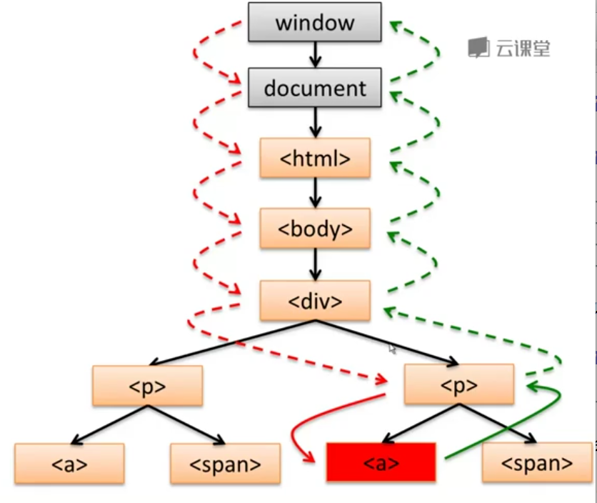
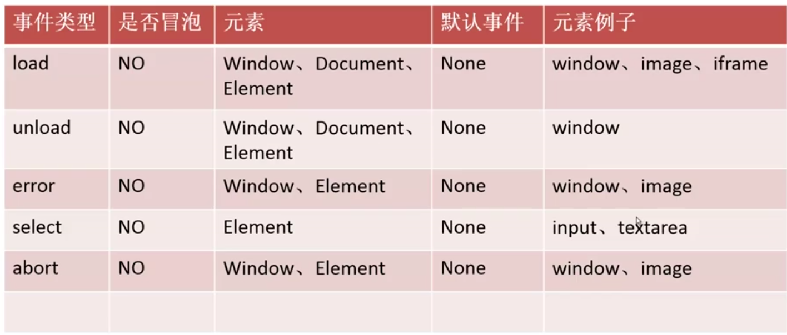
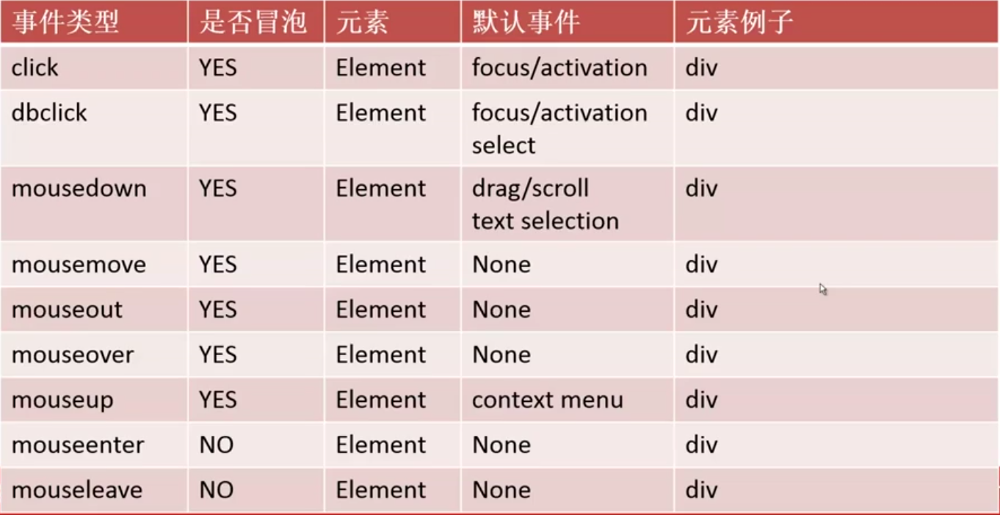

<!-- START doctoc generated TOC please keep comment here to allow auto update -->
<!-- DON'T EDIT THIS SECTION, INSTEAD RE-RUN doctoc TO UPDATE -->
**Table of Contents**  *generated with [DocToc](https://github.com/thlorenz/doctoc)*

- [事件](#%E4%BA%8B%E4%BB%B6)
  - [DOM 事件](#dom-%E4%BA%8B%E4%BB%B6)
    - [什么是DOM 事件](#%E4%BB%80%E4%B9%88%E6%98%AFdom-%E4%BA%8B%E4%BB%B6)
    - [DOM 事件流](#dom-%E4%BA%8B%E4%BB%B6%E6%B5%81)
    - [事件注册](#%E4%BA%8B%E4%BB%B6%E6%B3%A8%E5%86%8C)
    - [取消事件注册](#%E5%8F%96%E6%B6%88%E4%BA%8B%E4%BB%B6%E6%B3%A8%E5%86%8C)
    - [触发事件](#%E8%A7%A6%E5%8F%91%E4%BA%8B%E4%BB%B6)
    - [实现浏览器兼容（IE6、7、8）事件操作](#%E5%AE%9E%E7%8E%B0%E6%B5%8F%E8%A7%88%E5%99%A8%E5%85%BC%E5%AE%B9%EF%BC%88ie6%E3%80%817%E3%80%818%EF%BC%89%E4%BA%8B%E4%BB%B6%E6%93%8D%E4%BD%9C)
  - [事件对象](#%E4%BA%8B%E4%BB%B6%E5%AF%B9%E8%B1%A1)
    - [什么是事件对象](#%E4%BB%80%E4%B9%88%E6%98%AF%E4%BA%8B%E4%BB%B6%E5%AF%B9%E8%B1%A1)
    - [事件对象的通用属性](#%E4%BA%8B%E4%BB%B6%E5%AF%B9%E8%B1%A1%E7%9A%84%E9%80%9A%E7%94%A8%E5%B1%9E%E6%80%A7)
    - [事件对象的通用方法](#%E4%BA%8B%E4%BB%B6%E5%AF%B9%E8%B1%A1%E7%9A%84%E9%80%9A%E7%94%A8%E6%96%B9%E6%B3%95)
  - [事件分类](#%E4%BA%8B%E4%BB%B6%E5%88%86%E7%B1%BB)
    - [Event](#event)
    - [UIEvent](#uievent)
    - [MouseEvent](#mouseevent)
    - [WheelEvent](#wheelevent)
    - [FocusEvent](#focusevent)
    - [InputEvent](#inputevent)
    - [KeyboardEvent](#keyboardevent)
  - [事件代理](#%E4%BA%8B%E4%BB%B6%E4%BB%A3%E7%90%86)

<!-- END doctoc generated TOC please keep comment here to allow auto update -->

## 事件

### DOM 事件

#### 什么是DOM 事件

- 点击一个DOM元素
- 键盘按下一个键
- 输入框输入内容
- 页面加载完成

以上的所有操作都会触发一个DOM事件

#### DOM 事件流

一个 DOM 事件可以分为`捕获过程`、`触发过程`、`冒泡过程`。

- capture phase 捕获过程（图中红色虚线部分）

当 DOM 事件发生时，它会从window节点一路跑下去直到触发事件元素的父节点为止，去捕获触发事件的元素



- target phase 事件触发过程（图中实线部分）

当事件被捕获之后就开始执行事件绑定的代码

- bubble phase 冒泡过程（图中绿色虚线部分）

当事件代码执行完毕后，浏览器会从触发事件元素的父节点开始一直冒泡到window元素（**即元素的祖先元素也会触发这个元素所触发的事件**）

下面的例子演示了冒泡过程。我们在为每个li绑定了click事件，为ul绑定了click事件。每当我们点击li元素的时候，总会触发ul元素的click事件。

```html
<!DOCTYPE html>
<html lang="en">
<head>
	<meta charset="UTF-8">
	<title>Event Manipulation</title>
</head>
<body>
	<ul id="name">
		<li>Tom</li>
		<li>Jason</li>
		<li>Marry</li>
		<li>Tomas</li>
	</ul>
	<script type="text/javascript">
		var ulNode = document.getElementById("name");
		var liNodes = ulNode.getElementsByTagName("li");
		//事件绑定函数
		var ulClickHandler = function(){
			alert("I'm ul node.");
		}
		var liClickHandler = function(event){
			event = event || window.event;
			var target = event.target || evetn.srcElement;
			alert("I'm " + target.innerText);
		}
		// 1. 为<ul>元素添加点击事件
		ulNode.addEventListener("click", ulClickHandler, false);
		// 2. 为<li>元素添加点击事件
		for(var i = 0; i < liNodes.length; i++){
			liNodes[i].addEventListener("click", liClickHandler, false);
		}
	</script>
</body>
</html>
```

NOTE：并不是所有事件都会有这3个过程。比如在IE的事件流中，只有target phase 和 bubble phase两个过程，没有capture phase过程。而一些事件是没3个过程的（如：window的load事件没有冒泡过程）。

#### 事件注册

`evenTarget.addEvenListener(type, listener [,useCapture])`

- evenTarget：表示要绑定事件的DOM元素
- type：表示要绑定的事件，如："click"
- listener：表示要绑定的函数
- useCapture：可选参数，表示是否捕获过程

**事件注册的几种方式**

以button的Click事件为例：

```
<button id="btn">click me</button>
function clickBtn(event){  //传入event对象
    alert('click!');
}
```

1. 直接在元素上绑定回调函数 

`<button id="btn" onclick="clickBtn()">click me</button>`

2. JS获取DOM元素对象后，对onclick属性赋值，绑定事件     

`document.getElementById('btn').onclick=clickBtn;`

3. JS获取DOM对象后，调用对象的addEventListener函数绑定事件

`document.getElementById('btn').addEventListener('click',clickBtn);`

#### 取消事件注册

`evenTarget.removeEvenListener(type, listener [,useCapture])`

- evenTarget：表示要绑定事件的DOM元素
- type：表示要绑定的事件，如："click"
- listener：表示要绑定的函数
- useCapture：可选参数，表示是否捕获过程

#### 触发事件

要主动触发事件必须先创建一个继承了Event接口的对象，并初始化参数：

```javascript
var myClickEvent = document.createEvent("UIEvent");
myClickEvent.initUIEvent("click", true, true);
```

之后用dispatchEvent()方法触发：		

`inputNode.dispatchEvent(myClickEvent);`

```html
<!DOCTYPE html>
<html lang="en">
<head>
	<meta charset="UTF-8">
	<title>Event Manipulation</title>
</head>
<body>
	<input id="btn" type="button" value="Click to change the font color"/>
	<script type="text/javascript">
		var inputNode = document.getElementById("btn");
		var changeColor = function(){
			var inputNode = document.getElementById("btn");
			inputNode.style.color = "white";
			inputNode.style.background = "black";
		}
		// 1.注册事件
		inputNode.addEventListener("click", changeColor, false);
		// 2.取消事件注册
		// inputNode.removeEventListener("click", changeColor, false);  
		// 3.触发事件
		var myClickEvent = document.createEvent("Event");
		myClickEvent.initEvent("click", true, true);
		inputNode.dispatchEvent(myClickEvent);
	</script>
</body>
</html>
```

#### 实现浏览器兼容（IE6、7、8）事件操作

IE6/7/8 中是没有addEventListener/removeEventListener/dispatchEvent函数的，但IE提供了下面的方法来进行事件操作。

- 事件注册与取消

attachEvent/detachEvent

- 事件触发

fireEvent(e)

**下面的方法可以实现事件注册、事件取消的兼容**

```script
/* 兼容addEventListener方法 */
var addEvent = document.addEventListener ? 
	function(elem, type, listener, useCapture){
		elem.addEventListener(type, listener, useCapture);
	} :
	function(elem, type, listener, useCapture){
		elem.attachEvent('on' + type, listener);
	};
/* 兼容removeEventListener方法 */
var delEvent = document.removeEventListener ? 
	function(elem, type, listener, useCapture){
		elem.removeEventListener(type, listener, useCapture);
	} :
	function(elem, type, listener, useCapture){
		elem.detachEvent('on' + type, listener);
	};	
```

### 事件对象

#### 什么是事件对象

```javascript
//event就是事件对象
var clickHandler = function(event){
	//TODO
}
```

上面代码中的event就是事件对象，它包含了触发事件的一系列信息，如点击时鼠标所在的坐标、在屏幕的位置等等。

**兼容IE浏览器获取事件对象的方式**

```javascript
//兼容获取事件信息
var clickHandler = function(event){
	//1. 获取事件对象
	event = event || window.event; 
	//2. 获取触发事件的元素对象
	//var target = event.target || event.srcElement;
	//TODO
}
```

#### 事件对象的通用属性

- type 

事件类型

- target(srcElement) 

触发事件的对象,在IE中是srcElement，在W3C标准中是target

- currentTarget 

当前处理的事件节点

#### 事件对象的通用方法

- stopPropagation()	阻止冒泡

- preventDefault()	阻止默认行为

- stopImmediatePropogation()	阻止冒泡

**event.stopPropagation()(W3C)**

用来阻止事件继续向父节点扩散（冒泡），而在IE低版本中用event.cancelBubble=true来阻止事件传播

```html
<!DOCTYPE html>
<html lang="en">
<head>
	<meta charset="UTF-8">
	<title>Event Manipulation</title>
</head>
<body>
	<ul id="name">
		<li>Tom</li>
		<li>Jason</li>
		<li>Marry</li>
		<li>Tomas</li>
	</ul>
	<script type="text/javascript">
		var ulNode = document.getElementById("name");
		var liNodes = ulNode.getElementsByTagName("li");
		//事件绑定函数
		var ulClickHandler = function(){
			alert("I'm ul node.");
		}
		var liClickHandler = function(event){
			event = event || window.event;
			var target = event.target || evetn.srcElement;
			alert("I'm " + target.innerText);
			//阻止冒泡
			event.stopPropagation();
		}
		// 1. 为<ul>元素添加点击事件
		ulNode.addEventListener("click", ulClickHandler, false);
		// 2. 为<li>元素添加点击事件
		for(var i = 0; i < liNodes.length; i++){
			liNodes[i].addEventListener("click", liClickHandler, false);
		}
	</script>
</body>
</html>
```

**stopImmediatePropagation()(W3C)**

也是用来阻止冒泡，但是它比stopPropagation()多了一个操作，即它会停止该元素绑定在event事件上其他处理函数的发生，看一下例子：

```html
<!DOCTYPE html>
<html lang="en">
<head>
	<meta charset="UTF-8">
	<title>Event Manipulation</title>
	<style type="text/css">
		div{width: 100px; height: 100px; background-color: pink;}
	</style>
</head>
<body>
	<div id="pinkArea">100*100 Pink Area</div>
	<script type="text/javascript">
		var divNode = document.getElementById("pinkArea");
		var divNodeHandler = function(event){
			event = event || window.event;
			var target = event.target || event.srcElement;
			alert("I'm the " + event.type + " Event.");
			//阻止冒泡，并阻止元素绑定的其他mouseup事件的发生
			//但并不会阻止绑定在该元素的click事件的发生
			event.stopImmediatePropagation();
		}
		var anotherDivNodeHandler = function(event){
			event = event || window.event;
			var target = event.target || event.srcElement;
			alert("[anotherDivNodeHandler]I'm the " + event.type + " Event.");
		}
		var divNodeClickHandler = function(event){
			event = event || window.event;
			var target = event.target || event.srcElement;
			alert("I'm the " + event.type + " Event.");
		}
		//添加mouseup事件
		divNode.addEventListener("mouseup", divNodeHandler, false);
		//添加mouseup事件
		divNode.addEventListener("mouseup", anotherDivNodeHandler, false);
		//添加lick事件
		divNode.addEventListener("click", divNodeClickHandler, false);
	</script>
</body>
</html>
```

上面中，我们在divNode节点对mouseup事件绑定了两个函数，首先触发了divNodeHandler函数，并在该函数内调用了stopImmediatePropagation函数，stopImmediatePropagation函数就阻止了`divNode.addEventListener("mouseup", anotherDivNodeHandler, false);`中anotherDivNodeHandler函数的触发。

**Event.preventDefault()(W3C)**

用来阻止元素的默认行为，在IE的低版本中用**Event.returnValue=false**来阻止默认行为。

```html
<!DOCTYPE html>
<html lang="en">
<head>
	<meta charset="UTF-8">
	<title>Event Manipulation</title>
</head>
<body>
	<a href="http://www.baidu.com">This example demonstrates simulating a click on a checkbox using DOM document.createEvent, event.initMouseEvent, and element.dispatchEvent methods, as well as</a>
	<script type="text/javascript">
		var pNode = document.querySelector("a");
		var pNodeDCHandler = function(event){
			event = event || window.event;
			var target = event.target || event.srcElement;
			alert("I'm the " + event.type + " Event.");
			//阻止默认事件的发生(不跳转链接)
			event.preventDefault();
		}
		//绑定双击事件
		pNode.addEventListener("click", pNodeDCHandler, false);
	</script>
</body>
</html>
```

NOTE：默认行为就是当我们点击一个链接的时候，链接默认就会打开。当我们双击文字的时候，文字就会被选中。

### 事件分类


#### Event 



- load 页面加载完成
- unload 关闭页面的时候
- error 发生错误的时候（比如给img设置了一个错误的src值）
- select 文本被选中的时候
- abort 被中断

**window**

具有Event的load/unload/error/abort事件

**image**

具有Event的load/error/abort事件

#### UIEvent 

- resize 大小改变
- scroll 滚动跳滚动 


#### MouseEvent



[MARK mouseEnter/mouseOver的区别]

**属性**

- clientX, clientY 

事件发生时，鼠标在页面中的坐标
 
- screenX, screenY

事件发生时，鼠标在屏幕中的坐标

- ctrlKey, shiftKey, altKey, metaKey

用于判断发生这个事件时，对应的键是否按下，如果按下了则其值是true

- button

button属性有3个值，分别是0, 1, 2，分别代表按下的是左键，中间键，右键，用于判断用户按下了哪个键。

**MouseEvent顺序**

- 从元素A上方移过

mouseover -> mouseover(A) -> mouseenter(A) -> 许多个mousemove(A) -> mouseleave(A)

- 点击元素

mousedown -> [mousemove] -> mouseup -> click

**实现拖拽效果**

需要处理 mousedown, mousemove, mouseup 3个事件

[MARK 实现这个JS拖拽效果]

#### WheelEvent 


**属性**

- deltaMode 指定滚动值的单位
- deltaX 指定滚轮在X轴上的滚动距离
- deltaY
- deltaZ

#### FocusEvent


- blur 元素失去焦点时
- focus 元素获得焦点时
- focusin 即将获得焦点时
- focusout 即将失去焦点时
  
**属性**

relatedTarget 获取那个相关的获取（失去）焦点的元素

#### InputEvent


- beforeinput 已经开始输入，但是文字还没显示出来的时候。可以用来做一个预处理
- input 文字已经输入的时候
 
```html
<!DOCTYPE html>
<html lang="en">
<head>
	<meta charset="UTF-8">
	<title>Event Manipulation</title>
</head>
<body>
	<input id="name" type="text" />
	<script type="text/javascript">
		var nameNode = document.getElementById("name");
		var inputHandler = function(event){
			event = event || window.event;
			var target = event.target || event.srcElement;
			target.style.background = "pink";
		}
		nameNode.addEventListener("input", inputHandler, false);
	</script>
</body>
</html>
```
 
NOTE：IE中没有input事件，你可以用onpropertychange事件来代替。

#### KeyboardEvent 


**属性**

- key 代表按下的键
- code 代表按键码
- ctrlKey/shiftKey/altKey/metaKey 表示对应的键是否被按下
- repeat 是否持续按下了某个键
- keyCode/charCode/which 可以获取用户按下按键的ASCII码

### 事件代理

**如何实现事件代理**

- 1.将事件注册到元素的父节点上
- 2.用event.target 或 window.event.srcElement(IE) 就可以得到触发此次事件的具体元素

```html
<!DOCTYPE html>
<html lang="en">
<head>
	<meta charset="UTF-8">
	<title>Event Manipulation</title>
</head>
<body>
	<ul id="ul">
		<li>Tom</li>
		<li>Marry</li>
		<li>Json</li>
		<li>Thomas</li>
	</ul>
	<script type="text/javascript">
		var ulNode = document.getElementById("ul");
		var clickHandler = function(event){
			event = event || window.event;
			var target = event.target || event.srcElement;
			alert("I'm " + target.innerText);
		}
		//事件代理（将事件绑定到父节点上）
		ulNode.addEventListener("click", clickHandler, false);
	</script>
</body>
</html>
```

**优点**

- 需要管理的handler更少
- 需要的内存更少
- 增加/删除节点可以不处理事件

**缺点**

- 事件管理的逻辑更复杂