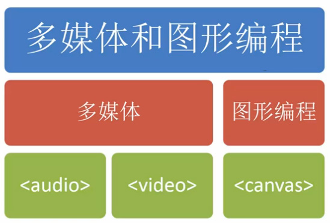

<!-- START doctoc generated TOC please keep comment here to allow auto update -->
<!-- DON'T EDIT THIS SECTION, INSTEAD RE-RUN doctoc TO UPDATE -->
**Table of Contents**  *generated with [DocToc](https://github.com/thlorenz/doctoc)*

- [多媒体](#%E5%A4%9A%E5%AA%92%E4%BD%93)
  - [基本用法](#%E5%9F%BA%E6%9C%AC%E7%94%A8%E6%B3%95)
  - [控制多媒体](#%E6%8E%A7%E5%88%B6%E5%A4%9A%E5%AA%92%E4%BD%93)
  - [多媒体事件](#%E5%A4%9A%E5%AA%92%E4%BD%93%E4%BA%8B%E4%BB%B6)
  - [多媒体支持类型](#%E5%A4%9A%E5%AA%92%E4%BD%93%E6%94%AF%E6%8C%81%E7%B1%BB%E5%9E%8B)
  - [多媒体格式兼容](#%E5%A4%9A%E5%AA%92%E4%BD%93%E6%A0%BC%E5%BC%8F%E5%85%BC%E5%AE%B9)
  - [Web Audio API](#web-audio-api)

<!-- END doctoc generated TOC please keep comment here to allow auto update -->

## 多媒体

在 HTML5 出现之前，页面中插入多媒体需要借助第三方插件，例如 Flash，但是 HTML5 将网页中的多媒体带入了新的一章。



### 基本用法

因为audio标签和video标签的用法完全一样，因此下面将以audio标签为例说明。

```html
<!-- Simple audio playback -->
<audio src="Jack.mp3" controls>
  Your browser does not support the <code>audio</code> element.
</audio>
```

此外，我们还可以在audio标签里用`<source>`来替代audio中的src属性来指定播放源。你还可以指定多个`<source>`从而提供多个数据源，浏览器会选择一个最佳的数据源播放。

```html
<!-- Audio playback with <source> -->
<audio controls>
  <source src="Jack.mp3" type="audio/mpeg">
  <source src="Jack.flac" type="audio/flac">  
  Your browser does not support the <code>audio</code> element.
</audio>
```

在上面的例子中，audio标签中还指定了autoplay属性，它表示为这个多媒体元素创建一个控制条。此除了可以设置controls之外，我们还可以设置如下属性：

|属性|是否必须|默认值|备注|
|----|--------|------|----|
|src|是||音频文件地址 URL|
|controls|否|false|显示控件|
|autoplay|否|false|音频就绪后自动播放|
|preload|否|none|可取值为 none、metadata、auto。音频在页面加载是进行加载，并预备播放。如果使用 autoplay 则忽略该属性（该属性失效）|
|loop|否|false|是否循环播放|

NOTE：none表示不预加载，metadata表示只预加载媒体的元信息，auto表示加载媒体的全部内容。

**向下兼容的HTML多媒体代码**

HTML5之前是不支持audio和video标签的，因此为了使代码更加兼容，我们可以在audio和video标签中插入object元素，当HTML5不被支持时，浏览器将会解析object标签中的内容。

```html
<!-- Audio -->
<audio autobuffer autoloop loop controls>
  <source src="/media/audio.mp3" type="audio/mpeg">
  <!-- When HTML5 was disabled, using the object element -->
  <object type="audio/x-wav" data="/media/audio.wav" width="290" height="45">
      <param name="src" value="/media/audio.wav">
      <param name="autoplay" value="false">
      <param name="autoStart" value="0">
      <p><a href="/media/audio.wav">Download this audio file.</a></p>
  </object>
</audio>

<!-- Video -->
<video autobuffer autoloop loop controls width=320 height=240>
  <source src="/media/video.oga" type="video/webm;codecs='vp8,vorbis'">
  <!-- When HTML5 was disabled, using the object element -->
  <object type="video/ogg" data="/media/video.oga" width="320" height="240">
      <param name="src" value="/media/video.oga">
      <param name="autoplay" value="false">
      <param name="autoStart" value="0">
      <p><a href="/media/video.oga">Download this video file.</a></p>
  </object>
</video>
```

### 控制多媒体

**方法**

- `load()` 加载资源
- `play()` 播放
- `pause()` 暂停播放

**属性**

- `playbackRate` 1为正常速度播放，大于1为快速播放最高20。
- `currentTime` 调准播放时间，以秒为单位。
- `volume` 取值范围0到1
- `muted` 静音，取值为boolean类型

**只读属性**

- `paused` 布尔值，暂停
- `seeking` 布尔值，跳转
- `ended` 布尔值，播放完成
- `duration` 媒体时长，数值
- `initialTime` 媒体开始播放时间，数值

下面的例子中，我们播放一个Jack.mp3的文件，并将其播放速率调至1.5倍，从第60秒的时候开始播放。

```html
<!DOCTYPE html>
<html lang="en">
<head>
  <meta charset="UTF-8">
  <title>Jack's Music</title>
</head>
<body>
  <audio controls>
    <source src="Jack.mp3" type="audio/mpeg">
    You browser do not support the audio tag.
  </audio>
  <script type="text/javascript">
    var audioNode = document.querySelector("audio");
    audioNode.playbackRate = 1.5;
    audioNode.currentTime = 60;
    audioNode.play();
  </script>
</body>
</html>
```

### 多媒体事件

- `loadstart` 开始请求媒体内容
- `loadmetadata` 媒体元数据以加载完成（时长，编码格式等）
- `canplay` 加载一些内容但可播放
- `play` 调用`play()`或设置 `autoplay`
- `waiting` 缓冲数据不够，暂停播放
- `playing` 正在进行播放

下面的例子在对`<audio>`标签的6个事件进行了监听，播放源是来自百度的《小苹果》。

```html
<!DOCTYPE html>
<html lang="en">
<head>
  <meta charset="UTF-8">
  <title>Jack's Music</title>
</head>
<body>
  <audio controls>
    <source src="http://yinyueshiting.baidu.com/data2/music/134379742/12012502946800128.mp3?xcode=088f7216d495c21c5342a3548728ab76" type="audio/mpeg">
    You browser do not support the audio tag.
  </audio>
  <p id="msg"></p>
  <script type="text/javascript">
    var audioNode = document.querySelector("audio");
    var msgNode = document.getElementById("msg");
    audioNode.addEventListener("loadstart", function(){msgNode.innerHTML += "<br>LoadStart."}, false);
    audioNode.addEventListener("loadmetadata", function(){msgNode.innerHTML += "<br>loadmetadata."}, false);
    audioNode.addEventListener("canplay", function(){msgNode.innerHTML +="<br>CanPlay."}, false);
    audioNode.addEventListener("waiting", function(){msgNode.innerHTML += "<br>Waiting."}, false);
    audioNode.addEventListener("play", function(){msgNode.innerHTML += "<br>Play."}, false);
    audioNode.addEventListener("playing", function(){msgNode.innerHTML += "<br>Playing."}, false);
    /* play */
    audioNode.playbackRate = 1;
    audioNode.currentTime = 60;
    audioNode.play();
  </script>
</body>
</html>
```

**全部事件列表**

事件[列表](http://www.w3.org/wiki/HTML/Elements/audio#Media_Events)

### 多媒体支持类型

HTML5播放多媒体并不支持所有格式，HTML支持的音频和视频格式列表可以通过下面网址查询到。

HTML5 支持音频[列表](http://en.wikipedia.org/wiki/HTML5_Audio#Supported_audio_coding_formats)

HTML5 支持视频[列表](http://en.wikipedia.org/wiki/HTML5_video#Browser_support)

### 多媒体格式兼容

测试音频兼容性

```javascript
var a = new Audio();
// 检测媒体类型返回
// 支持 - 'maybe' 或 'probably'
// 不支持 - ''
a.canPlayType('audio/nav');
```

测试视频兼容性

```javascript
var a = document.querySelector("video");
// 检测媒体类型返回
// 支持 - 'maybe' 或 'probably'
// 不支持 - ''
a.canPlayType('video/webm');
```

NOTE：测试视频兼容性不能使用`var a = new Video();`获得视频对象，而是要在页面中声明一个video元素，然后通过DOM操作获取到video对象，再调用canPlayType方法。

### Web Audio API

audio和video标签已经可以满足了日常对于多媒体的需求，但是如果要进行一些更加复杂和高级的操作，audio和video就无法满足了。此时，你可以使用Web Audio API 可以进行更加高级的音频处理。

音频 W3C 官网定义在[这里](http://webaudio.github.io/web-audio-api/)

Mozilla 官方音频教程在[这](https://developer.mozilla.org/en-US/docs/Web/API/Web_Audio_API)，以及第三方[教程 1](http://www.html5rocks.com/en/tutorials/webaudio/intro/)和[教程 2](http://webaudioapi.com/)。