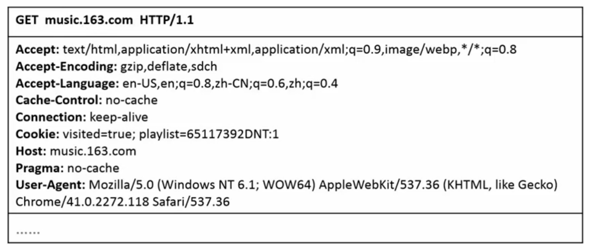
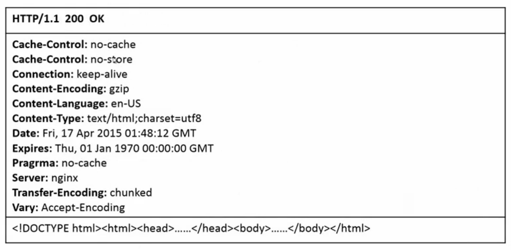
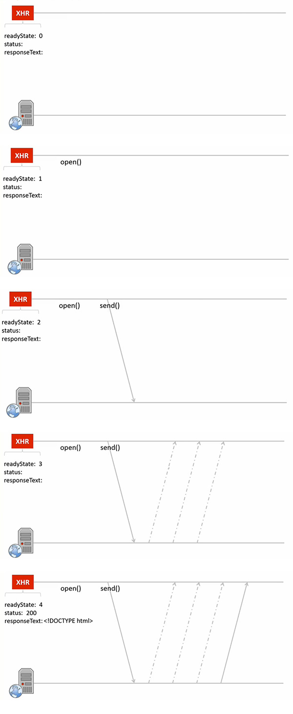
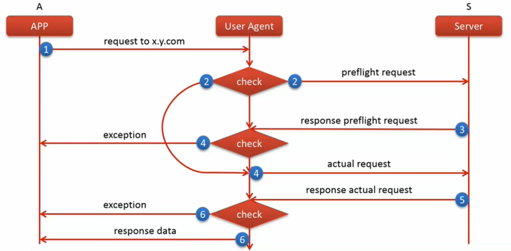
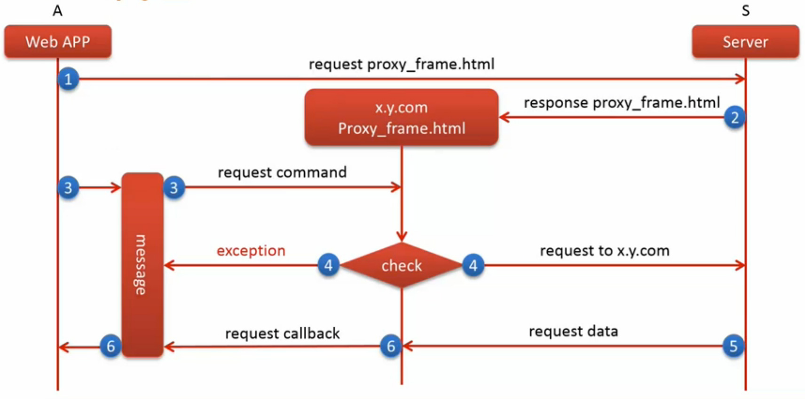

<!-- START doctoc generated TOC please keep comment here to allow auto update -->
<!-- DON'T EDIT THIS SECTION, INSTEAD RE-RUN doctoc TO UPDATE -->
**Table of Contents**  *generated with [DocToc](https://github.com/thlorenz/doctoc)*

- [数据通信](#%E6%95%B0%E6%8D%AE%E9%80%9A%E4%BF%A1)
  - [HTTP](#http)
    - [HTTP 事务](#http-%E4%BA%8B%E5%8A%A1)
    - [HTTP 请求报文](#http-%E8%AF%B7%E6%B1%82%E6%8A%A5%E6%96%87)
    - [HTTP 回复报文](#http-%E5%9B%9E%E5%A4%8D%E6%8A%A5%E6%96%87)
    - [常用 HTTP 方法](#%E5%B8%B8%E7%94%A8-http-%E6%96%B9%E6%B3%95)
    - [URL 构成](#url-%E6%9E%84%E6%88%90)
    - [HTTP 版本](#http-%E7%89%88%E6%9C%AC)
    - [常见 HTTP 状态码](#%E5%B8%B8%E8%A7%81-http-%E7%8A%B6%E6%80%81%E7%A0%81)
  - [AJAX](#ajax)
    - [AJAX 调用](#ajax-%E8%B0%83%E7%94%A8)
      - [open()](#open)
      - [setRequestHeader()](#setrequestheader)
      - [send()](#send)
      - [请求参数序列化](#%E8%AF%B7%E6%B1%82%E5%8F%82%E6%95%B0%E5%BA%8F%E5%88%97%E5%8C%96)
    - [用 AJAX 发送 GET 请求](#%E7%94%A8-ajax-%E5%8F%91%E9%80%81-get-%E8%AF%B7%E6%B1%82)
    - [用 AJAX 发送 POST 请求](#%E7%94%A8-ajax-%E5%8F%91%E9%80%81-post-%E8%AF%B7%E6%B1%82)
    - [同源策略](#%E5%90%8C%E6%BA%90%E7%AD%96%E7%95%A5)
    - [跨域资源访问](#%E8%B7%A8%E5%9F%9F%E8%B5%84%E6%BA%90%E8%AE%BF%E9%97%AE)
    - [其他跨域技术](#%E5%85%B6%E4%BB%96%E8%B7%A8%E5%9F%9F%E6%8A%80%E6%9C%AF)

<!-- END doctoc generated TOC please keep comment here to allow auto update -->

## 数据通信

### HTTP

#### HTTP 事务


#### HTTP 请求报文



- 请求行（request line）：包括请求方法、主机地址、HTTP 协议版本号。
- 请求头部（header）：由键值对组成。
- 请求体（request body）：因为此请求为 GET 请求，所以请求体为空。

#### HTTP 回复报文



- 请求行（request line）：包括 HTTP 版本号、状态码、状态码描述。   
- 请求头部（header）：依然为键值对组成，其中Expires为缓存有效期。   
- 请求体（request body）：主体则为 HTML 文件。

#### 常用 HTTP 方法

**常用方法**

|方法|描述|是否包含主体|
|----|----|------------|
|GET|从服务器获取一份文档|否|
|POST|向服务器发送需要处理的数据|是|
|PUT|将请求的主题部分储存在服务器上|是|
|DELETE|从服务器删除一份文档|否|

**不常用方法**

|方法|描述|是否包含主题|
|----|----|------------|
|HEAD|只从服务器获取头文档的首部|否|
|TRACE|对可能经过代理服务器传送到服务器上的报文进行追踪|否|
|OPTIONS|决定可以在服务器上执行的方法|否|

#### URL 构成

```html
http://www.github.com:8080/index.html?user=li-xinyang&lang=zh-CN#home
  |          |          |       |                  |              |
protocol     |          |       |                  |              |
          hostname     port     |                  |              |
              \        /    pathname             search          hash
                 host
```

**URL中的可选部分**

- port
- pathname
- search
- hash

#### HTTP 版本

- HTTP/0.9 1991年 HTTP 原型，存在设计缺陷
- HTTP/1.0 第一个广泛应用版本
- HTTP/1.0+ 添加持久的 keep-alive 链接，虚拟主机支持，代理连接支持，成为非官方的事实版本
- HTTP/1.1 校正结构性缺陷，明确语义，引入重要的新能优化措施，删除不好的特性（**当前使用版本**）

NOTE：此文写于2015年6月。

#### 常见 HTTP 状态码

|状态码|描述|代码描述|
|------|----|--------|
|200|请求成功，一般用于 GET 和 POST 方法|OK|
|301|资源移动。所请求资源自动到新的 URL，浏览器自动跳转至新的 URL | Moved Permanently|
|304|未修改。所请求资源未修改，浏览器读取缓存数据|Not Modified|
|400|请求语法错误，服务器无法解析|Bad Request|
|404|未找到资源，可以设置个性“404页面”|Not Found|
|500|服务器内部错误|Internal Server Error|

### AJAX

AJAX（Asynchronous JavaScript and HTML）异步获取数据的概念，由 Jesse James Garrett 在2005年提出。

**AJAX 请求全过程**



#### AJAX 调用

三步完成 AJAX 调用

1. 创建 XHR 对象
2. 处理返回数据及错误处理
3. 发送请求

```javascript
// 1. 创建XHR对象
var xhr = new XMLHttpRequest();
// 2. 处理返回数据及错误处理
xhr.onreadystatechange = function(callback) {
  if (xhr.readyState === 4) {
    if ((xhr.status >== 200 && xhr.status < 300) || xhr.status === 304) {
      callback(xhr.responseText);
    } else {
      console.error('Request was unsuccessful: ' + xhr.status);
    }
  }
}
// 3. 发送请求
xhr.open('get', 'exmaple.json', true);	//readyState:1
xhr.setRequestHeader('myHeader', 'myValue');
xhr.send(null);	//readyState:2   
```

当readyState为1时表示调用了open()方法、为2时表示发送了请求、为3时表示服务器开始返回数据，为4时表示服务器结束请求。

NOTE：`xhr.onload` 只针对当 `readyState === 4` 和 `status === 200` 时的事件。

**实现兼容多浏览器的AJAX异步调用**

可以参考这里的例子：[http://www.cnblogs.com/chanshuyi/articles/3934951.html](http://www.cnblogs.com/chanshuyi/articles/3934951.html)

##### open()

```javascript
xhr.open(method, url[, async = true]);
```

- `method` 为上面说过的 HTTP 方法（例如，GET、POST）
- `url` 为资源地址
- `async` 用于设置异步请求。默认为true，表示异步请求。

##### setRequestHeader()

```javascript
xhr.setRequestHeader('myHeader', 'myValue');
//example
xhr.setRequestHeader('Content-Type', 'application/x-www-form-urlencoded');
```

用于设置头部的键值对。

##### send()  

```javascript
xhr.send([data | null]);
// 1. 当为GET请求时，send不携带参数
xhr.send()
// 2. 当为POST请求时，send携带数据参数
// 不同类型的参数需要为xhr对象设置不同的请求头
xhr.send(data);
```

##### 请求参数序列化

将查询参数使用字符串，跟在url地址后面

```javascript
xhr.open('get', 'example.json?' + 'name=value&age=value', true);
```
如果要传输的是一个对象，那么也要将其转成上面的形式。下面的方法实现了这种转换：

**对象转换字符串的函数实现**

```javascript
function serialize(data) {
  if (!data) return '';
  var pairs = [];
  for (var name in data) {
    if (!data.hasOwnProperty(name)) continue;
    if (typeof data[name] === 'function') continue;
    var value = data[name].toString();
    name = encodeURIComponent(name);
    value = encodeURIComponent(value);
    pairs.push(name + '=' + value);
  }
  return pairs.join('&');
}
```

#### 用 AJAX 发送 GET 请求 

```javascript
var url = 'example.json?' + serialize(formData);
xhr.open('get', url, true);
xhr.send(null);
```

#### 用 AJAX 发送 POST 请求 

查询参数需要作为 `send()` 的存数传入。

```javascript
xhr.open('get', 'example.json', true);
xhr.send(serialize(formData));
```

#### 同源策略

两个页面拥有相同的协议（Protocol）、端口（Port）、和主机（host）那么这两个页面就是属于同一个源（Origin）。

```html
http://www.github.com:8080/index.html?user=li-xinyang&lang=zh-CN#home
  |          |          |       |                  |              |
protocol     |          |       |                  |              |
          hostname     port     |                  |              |
              \        /    pathname             search          hash
                 host
|-----完全一致则同源------|
```

#### 跨域资源访问

不满足同源策略的资源访问均属于跨域资源访问，W3C 定义了 [**CORS**](http://www.w3.org/TR/cors/)标准来实现跨域资源访问。现代浏览器已经实现了 CORS 的支持。

**CORS 原理实现图**



#### 其他跨域技术

- Frame 代理
- JSONP
- Comet
- Web Sockets
- ...

**Frame 代理**

关于 Frame 代理的更多内容在[这里](https://github.com/genify/nej/blob/master/doc/AJAX.md)。



优点：

- 参照 CORS 标准
- 支持各种请求方法 GET POST PUT DELETE

缺点：

- 需要在目标服务器防止代理文件（造成延时）
- 低版本在大并发消息通信机制会产生延时

**JSONP**

全程为 JSON with Padding（填充式 JSON），它利用 `<script>` 可以跨域的原理。请求一段 JavaScript 代码，然后执行 JavaScript 代码来实现跨域。

```javascript
function handleResponse(response) {
  alert(response.name);
}

var script = document.createElement('script');
script.src = 'http://localhost:3000/json?callback=handleResponse';
document.body.insertBefore(script, document.body.firstChild);
```

参考资料:   
- [http://kb.cnblogs.com/page/139725](http://kb.cnblogs.com/page/139725)