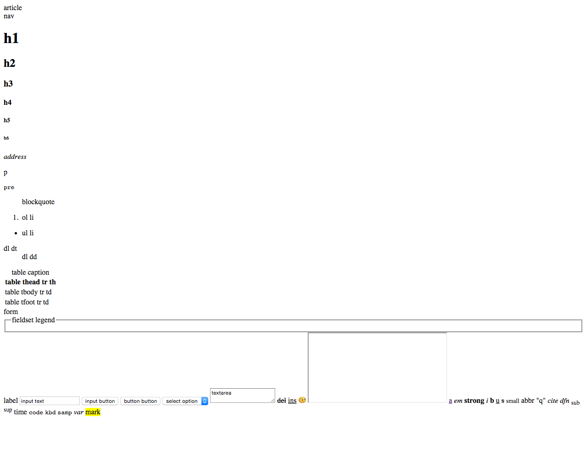
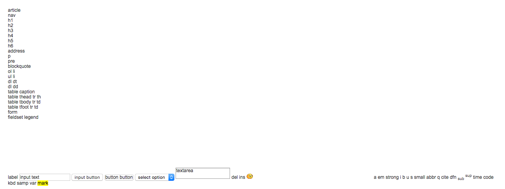

<!-- START doctoc generated TOC please keep comment here to allow auto update -->
<!-- DON'T EDIT THIS SECTION, INSTEAD RE-RUN doctoc TO UPDATE -->
**Table of Contents**  *generated with [DocToc](https://github.com/thlorenz/doctoc)*

- [CSS Reset](#css-reset)
  - [样式重置前后对比](#%E6%A0%B7%E5%BC%8F%E9%87%8D%E7%BD%AE%E5%89%8D%E5%90%8E%E5%AF%B9%E6%AF%94)
  - [CSS Reset 范例](#css-reset-%E8%8C%83%E4%BE%8B)
  - [如何做 CSS Reset](#%E5%A6%82%E4%BD%95%E5%81%9A-css-reset)

<!-- END doctoc generated TOC please keep comment here to allow auto update -->

## CSS Reset

所有的 HTML 标签在**没有设置**样式时均被浏览器默认的样式列表所装饰
（不同浏览器默认样式有所**不同**）。**CSS** 的样式重置就是清除浏览器的默认样式，可以理解为**对于全局的样式定义**。
对于开发者来言，如不重置每一个浏览器特定的默认样式，则会在开发造成诸多的不便。

> 在前端开发过程中做加法，远远比做减法简单。将所有浏览器的默认样式统一，可以使它们有一个相同起点。

NOTE+：浏览器对于控件的样式和功能的特性支持也可以重置
（例如日历，清除输入框内容按键等）。

### 样式重置前后对比

**样式重置前**



**样式重置后**



### CSS Reset 范例

```css
/* reset */
html,body,h1,h2,h3,h4,h5,h6,div,dl,dt,dd,ul,ol,li,p,blockquote,pre,hr,figure,table,caption,th,td,form,fieldset,legend,input,button,textarea,menu{margin:0;padding:0;}
header,footer,section,article,aside,nav,hgroup,address,figure,figcaption,menu,details{display:block;}
table{border-collapse:collapse;border-spacing:0;}
caption,th{text-align:left;font-weight:normal;}
html,body,fieldset,img,iframe,abbr{border:0;}
i,cite,em,var,address,dfn{font-style:normal;}
[hidefocus],summary{outline:0;}
li{list-style:none;}
h1,h2,h3,h4,h5,h6,small{font-size:100%;}
sup,sub{font-size:83%;}
pre,code,kbd,samp{font-family:inherit;}
q:before,q:after{content:none;}
textarea{overflow:auto;resize:none;}
label,summary{cursor:default;}
a,button{cursor:pointer;}
h1,h2,h3,h4,h5,h6,em,strong,b{font-weight:bold;}
del,ins,u,s,a,a:hover{text-decoration:none;}
body,textarea,input,button,select,keygen,legend{font:12px/1.14 arial,\5b8b\4f53;color:#333;outline:0;}
body{background:#fff;}
a,a:hover{color:#333;}
```

### 如何做 CSS Reset

**Reset First**

- 在项目初期就决定需要定义哪些全局样式
- Reset 文件需比页面其他样式文件的引入顺序优先（优先级需最高）

一份 CSS Reset 文件并不一定适用于所有场景，需要根据需求做出变通（以需符合产品需求为主）。一个比较简单可行的方法是直接复制上面的CSS Reset范例，然后根据自己的情况再进行修改。