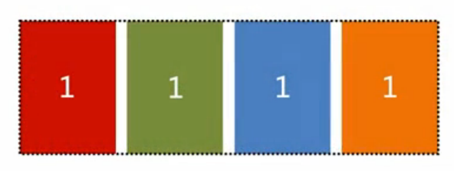
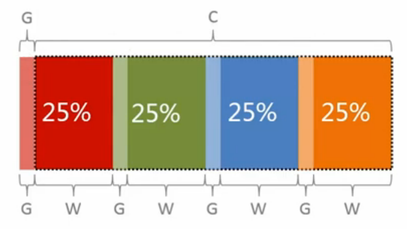
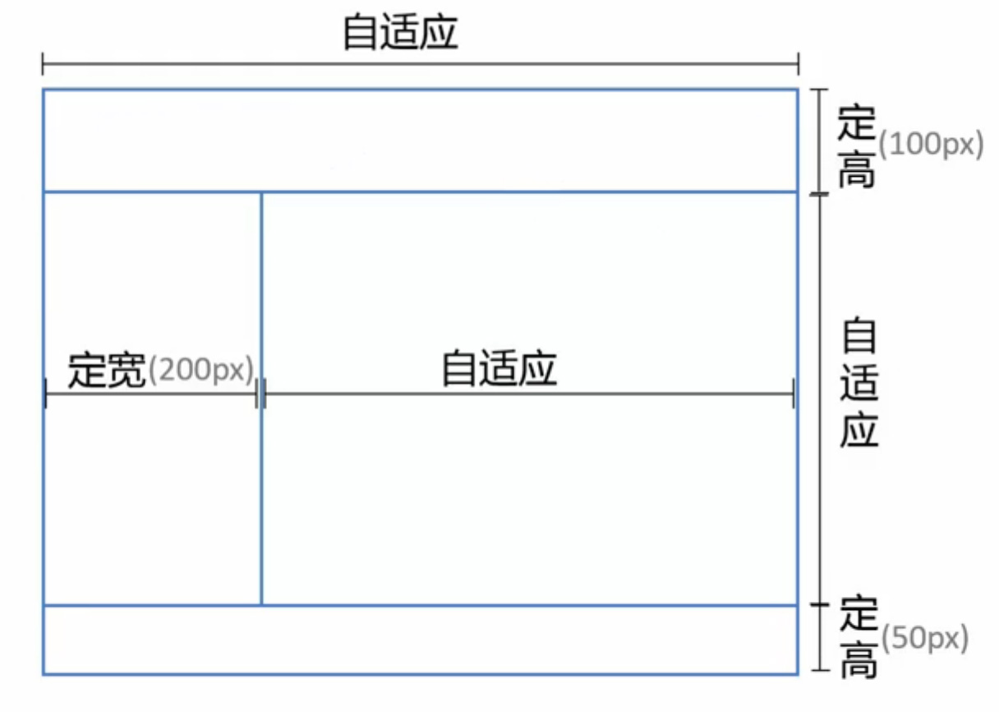
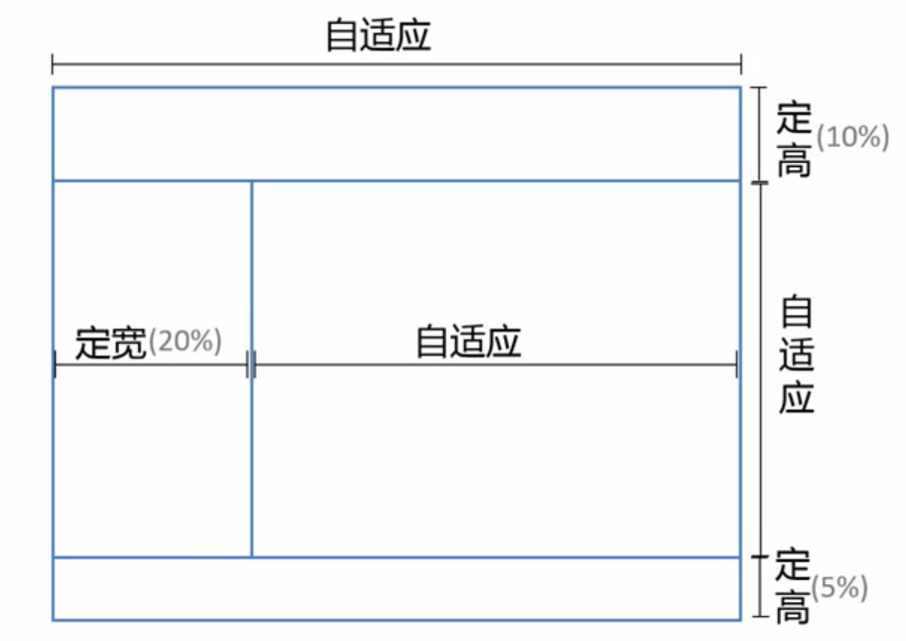

<!-- START doctoc generated TOC please keep comment here to allow auto update -->
<!-- DON'T EDIT THIS SECTION, INSTEAD RE-RUN doctoc TO UPDATE -->
**Table of Contents**  *generated with [DocToc](https://github.com/thlorenz/doctoc)*

- [布局解决方案](#%E5%B8%83%E5%B1%80%E8%A7%A3%E5%86%B3%E6%96%B9%E6%A1%88)
  - [居中布局](#%E5%B1%85%E4%B8%AD%E5%B8%83%E5%B1%80)
    - [水平居中](#%E6%B0%B4%E5%B9%B3%E5%B1%85%E4%B8%AD)
      - [inline-block + text-align](#inline-block--text-align)
      - [table + margin](#table--margin)
      - [absolute + transform](#absolute--transform)
      - [flex + justify-content](#flex--justify-content)
    - [垂直居中](#%E5%9E%82%E7%9B%B4%E5%B1%85%E4%B8%AD)
      - [table-cell + vertical-align](#table-cell--vertical-align)
      - [absolute + transform](#absolute--transform-1)
      - [flex + align-items](#flex--align-items)
    - [水平与垂直居中](#%E6%B0%B4%E5%B9%B3%E4%B8%8E%E5%9E%82%E7%9B%B4%E5%B1%85%E4%B8%AD)
      - [inline-block + text-align + table-cell + vertical-align](#inline-block--text-align--table-cell--vertical-align)
      - [absolute + transform](#absolute--transform-2)
      - [flex + justify-content + align-items](#flex--justify-content--align-items)
  - [多列布局](#%E5%A4%9A%E5%88%97%E5%B8%83%E5%B1%80)
    - [一列定宽，一列自适应](#%E4%B8%80%E5%88%97%E5%AE%9A%E5%AE%BD%EF%BC%8C%E4%B8%80%E5%88%97%E8%87%AA%E9%80%82%E5%BA%94)
      - [float + margin](#float--margin)
      - [float + margin + (fix) 改造版](#float--margin--fix-%E6%94%B9%E9%80%A0%E7%89%88)
      - [float + overflow](#float--overflow)
      - [table](#table)
      - [flex](#flex)
    - [两列定宽，一列自适应](#%E4%B8%A4%E5%88%97%E5%AE%9A%E5%AE%BD%EF%BC%8C%E4%B8%80%E5%88%97%E8%87%AA%E9%80%82%E5%BA%94)
    - [一列不定宽加一列自适应](#%E4%B8%80%E5%88%97%E4%B8%8D%E5%AE%9A%E5%AE%BD%E5%8A%A0%E4%B8%80%E5%88%97%E8%87%AA%E9%80%82%E5%BA%94)
    - [多列不定宽加一列自适应](#%E5%A4%9A%E5%88%97%E4%B8%8D%E5%AE%9A%E5%AE%BD%E5%8A%A0%E4%B8%80%E5%88%97%E8%87%AA%E9%80%82%E5%BA%94)
    - [多列等分布局](#%E5%A4%9A%E5%88%97%E7%AD%89%E5%88%86%E5%B8%83%E5%B1%80)
      - [float](#float)
      - [table](#table-1)
      - [flex](#flex-1)
    - [同增同减(等高)的一列定宽一列自适应](#%E5%90%8C%E5%A2%9E%E5%90%8C%E5%87%8F%E7%AD%89%E9%AB%98%E7%9A%84%E4%B8%80%E5%88%97%E5%AE%9A%E5%AE%BD%E4%B8%80%E5%88%97%E8%87%AA%E9%80%82%E5%BA%94)
      - [table](#table-2)
      - [flex](#flex-2)
      - [float](#float-1)
  - [全屏布局](#%E5%85%A8%E5%B1%8F%E5%B8%83%E5%B1%80)
    - [定宽需求](#%E5%AE%9A%E5%AE%BD%E9%9C%80%E6%B1%82)
      - [Position](#position)
      - [Flex](#flex)
    - [百分比宽度需求](#%E7%99%BE%E5%88%86%E6%AF%94%E5%AE%BD%E5%BA%A6%E9%9C%80%E6%B1%82)
    - [内容自适应](#%E5%86%85%E5%AE%B9%E8%87%AA%E9%80%82%E5%BA%94)
      - [Flex](#flex-1)
    - [方案比较](#%E6%96%B9%E6%A1%88%E6%AF%94%E8%BE%83)

<!-- END doctoc generated TOC please keep comment here to allow auto update -->

## 布局解决方案
了解 CSS 中属性的值及其特性， 透彻分析问题和需求才可以选择和设计最适合的布局解决方案。

### 居中布局

#### 水平居中


- 子元素于父元素水平居中
- 子元素与父元素宽度均可变

##### inline-block + text-align

```html
<div class="parent">
  <div class="child">Demo</div>
</div>

<style>
  .child {
    display: inline-block;
  }
  .parent {
    text-align: center;
  }
</style>
```

NOTE：`text-align`对inline元素起作用。

**优点**

- 兼容性佳（甚至可以兼容 IE 6 和 IE 7）

NOTE：在IE6/7中虽然不支持`display:inline-block`，但是可以通过其他方式来达到，网上也有许多解决方法。

**缺点**

- 子元素中的内容也会默认水平居中，需要在子元素中增加额外的代码（text-align）来修正，如：

```
.child{
	display: inline-block;
	text-align: left;  /* 重新设定对齐方式 */
}
```

##### table + margin

```html
<div class="parent">
  <div class="child">Demo</div>
</div>

<style>
  .child {
    display: table;
    margin: 0 auto;
  }
</style>
```

NOTE: `display: table` 在表现上类似 `block` 元素，但是默认宽度为内容宽。

**优点**

- 无需设置父元素样式 （支持 IE 8 及其以上版本）

NOTE：IE6、7不支持`display:table`。兼容 IE 8 以下版本需要调整为 `<table>` 的结构

##### absolute + transform

```html
<div class="parent">
  <div class="child">Demo</div>
</div>

<style>
  .parent {
    position: relative;
  }
  .child {
    position: absolute;
    left: 50%;
    transform: translateX(-50%);  //校正偏移。transformX的参照物为自身
  }
</style>
```

**优点**

- 绝对定位脱离文档流，不会对后续元素的布局造成影响。

**缺点**

- `transform` 为 CSS3 属性，有兼容性问题

##### flex + justify-content

```html
<div class="parent">
  <div class="child">Demo</div>
</div>

<style>
  .parent {
    display: flex;
    justify-content: center;
  }

  /* 或者下面的方法，可以达到一样的效果 */

  .parent {
    display: flex;
  }
  .child {
    margin: 0 auto;
  }
</style>
```

**优点**
- 只需设置父节点属性，无需设置子元素

**缺点**
- `flex`为CSS3属性，会有兼容性问题

|水平居中解决方案|兼容性|
|----|----| 
|inline-block+text-align|IE8+|
|table+margin|IE8+|
|absolute+transform|需支持CSS3|
|flex+justify-content|需支持CSS3|


#### 垂直居中


- 子元素于父元素垂直居中且
- 子元素与父元素高度均可变

##### table-cell + vertical-align

相对应与水平居中的`inline-block+text-align`

```html
<div class="parent">
  <div class="child">Demo</div>
</div>

<style>
  .parent {
    display: table-cell;
    vertical-align: middle;
  }
</style>
```

NOTE：`vertical-align`可以作用于`inline`、`table`、`cell`类的元素。

**优点**
- 兼容性好（支持 IE 8，IE8 以下版本需要调整页面结构至 `table`）

##### absolute + transform

```html
<div class="parent">
  <div class="child">Demo</div>
</div>

<style>
  .parent {
    position: relative;
  }
  .child {
    position: absolute;
    top: 50%;
    transform: translateY(-50%);
  }
</style>
```

**优点**
- 绝对定位脱离文档流，不会对后续元素的布局造成影响。

**缺点**
- `transform` 为 CSS3 属性，有兼容性问题

##### flex + align-items

```html
<div class="parent">
  <div class="child">Demo</div>
</div>

<style>
  .parent {
    display: flex;
    align-items: center;
  }
</style>
```

**优点**
- 只需设置父节点属性，无需设置子元素

**缺点**
- 有兼容性问题

|水平居中解决方案|垂直居中解决方案|兼容性|
|----|----|----|
|inline-block+text-align|table-cell+vertical-align|IE8+|
|table+margin|-----|IE8+|
|absolute+transform|absolute+transform|需支持CSS3|
|flex+justify-content|flex+align-items|需支持CSS3|


#### 水平与垂直居中


- 子元素于父元素**垂直及水平**居中
- 子元素与父元素高度宽度均可变

##### inline-block + text-align + table-cell + vertical-align

```html
<div class="parent">
  <div class="child">Demo</div>
</div>

<style>
  .parent {
    text-align: center;
    display: table-cell;
    vertical-align: middle;
  }
  .child {
    display: inline-block;
  }
</style>
```

**优点**
- 兼容性好

##### absolute + transform

```html
<div class="parent">
  <div class="child">Demo</div>
</div>

<style>
  .parent {
    position: relative;
  }
  .child {
    position: absolute;
    left: 50%;
    top: 50%;
    transform: translate(-50%, -50%);
  }
</style>
```

**优点**
- 绝对定位脱离文档流，不会对后续元素的布局造成影响。

**缺点**
- `transform` 为 CSS3 属性，有兼容性问题

##### flex + justify-content + align-items

```html
<div class="parent">
  <div class="child">Demo</div>
</div>

<style>
  .parent {
    display: flex;
    justify-content: center;
    align-items: center;
  }
</style>
```

**优点**
- 只需设置父节点属性，无需设置子元素

**缺点**
- 有兼容性问题

|水平居中解决方案|垂直居中解决方案|水平+垂直居中|兼容性|
|----|----|----|----|
|inline-block+text-align|table-cell+vertical-align|两者叠加|IE8+|
|table+margin|-----|-----|IE8+|
|absolute+transform|absolute+transform|两者叠加|需支持CSS3|
|flex+justify-content|flex+align-items|两者叠加|需支持CSS3|


### 多列布局

多列布局在网页中非常常见（例如两列布局），多列布局可以是以下几种情况：
- 多列定宽，一列自适应
- 多列不定宽，一列自适应
- 等分布局
- 等高布局

#### 一列定宽，一列自适应


##### float + margin

```html
<div class="parent">
  <div class="left">
    <p>left</p>
  </div>
  <div class="right">
    <p>right</p>  <!-- style="clear:both" -->
    <p>right</p>
  </div>
</div>

<style>
  .left {
    float: left;
    width: 100px;
    margin-left: -3px; /* 解决IE6的bug */
  }
  .right {
    margin-left: 100px
    /* 间距可再加入 margin-left */
  }
</style>
```

NOTE：IE 6 中会有3像素的 BUG，解决方法可以在 `.left`
加入 `margin-left:-3px`。

##### float + margin + (fix) 改造版

```html
<div class="parent">
  <div class="left">
    <p>left</p>
  </div>
  <div class="right-fix">
    <div class="right">
      <p>right</p>
      <p>right</p>
    </div>
  </div>
</div>

<style>
  .left {
    float: left;
    width: 100px;
    position: relative;
  }
  .right-fix {
    float: right;
    width: 100%;
    margin-left: -100px;
  }
  .right {
    margin-left: 100px
    /*间距可再加入 margin-left */
  }
</style>
```

NOTE：此方法不会存在 IE 6 中3像素的 BUG，但 `.left` 不可选择，
需要设置 `.left {position: relative}` 来提高层级。
此方法可以适用于多版本浏览器（包括 IE6）。缺点是多余的 HTML 文本结构。

##### float + overflow

```html
<div class="parent">
  <div class="left">
    <p>left</p>
  </div>
  <div class="right">
    <p>right</p>
    <p>right</p>
  </div>
</div>

<style>
  .left {
    float: left;
    width: 100px;
    <!-- margin-right: 20px; -->
  }
  .right {
    overflow: hidden;
  }
</style>
```

设置 `overflow: hidden` 会触发
BFC 模式（Block Formatting Context）块级格式化文本。
BFC 中的内容**与外界的元素是隔离的**。

**优点**

- 样式简单

**缺点**

- 不支持 IE 6

##### table

```html
<div class="parent">
  <div class="left">
    <p>left</p>
  </div>
  <div class="right">
    <p>right</p>
    <p>right</p>
  </div>
</div>

<style>
  .parent {
    display: table;
    width: 100%;
    table-layout: fixed;
  }
  .left {
    display: table-cell;
    width: 100px;
    <!-- padding-right:20px; -->
  }
  .right {
    display: table-cell;
    /*宽度为剩余宽度*/
  }
</style>
```

`table` 的显示特性为每列的单元格宽度之和**一定**等于表格宽度。
`table-layout: fixed;` 可加速渲染，也是设定布局优先。

NOTE：`table-cell` 中不可以设置 `margin` 但是可以通过 `padding` 来设置间距。

##### flex

```html
<div class="parent">
  <div class="left">
    <p>left</p>
  </div>
  <div class="right">
    <p>right</p>
    <p>right</p>
  </div>
</div>

<style>
  .parent {
    display: flex;
  }
  .left {
    width: 100px;
    margin-left: 20px;
  }
  .right {
    flex: 1;
    /*等价于*/
    /*flex: 1 1 0;*/
  }
</style>
```

NOTE：`flex-item` 默认为内容宽度。

**缺点**

- 低版本浏览器兼容问题
- 性能问题，只适合小范围布局

|一列定宽一列自适应布局解决方案|兼容性|
|-----|-----|
|float+margin|IE6有bug|
|float+margin+(fix) |IE6+|
|float+overflow|IE8+|
|table|无|
|flex|需支持CSS3|

#### 两列定宽，一列自适应


```html
<div class="parent">
  <div class="left">
    <p>left</p>
  </div>
  <div class="center">
    <p>center<p>
  </div>
  <div class="right">
    <p>right</p>
    <p>right</p>
  </div>
</div>

<style>
  .left, .center {
    float: left;
    width: 100px;
    margin-right: 20px;
  }
  .right {
    overflow: hidden;
    /*等价于*/
    /*flex: 1 1 0;*/
  }
</style>
```

多列定宽的实现可以更具单列定宽的例子进行修改与实现。


#### 一列不定宽加一列自适应


实现不定宽本质上是在之前的4种实现定宽方法的基础上进行修改，使其不设定固定宽度，让不定宽的宽度为内容决定。   
下面为可以实现此效果的方法：

- `float` + `overflow`，此方法在 IE6 中有兼容性问题

```
<style type="text/css">
	body{margin:20px;}
	.left{
		float: left;
		margin-right: 20px;
	}
	.right{
		overflow: hidden;
	}
	.left p{width: 200px;}
</style>
<div class="parent">
	<div class="left">
		<p>left</p>
	</div>
	<div class="right">
		<p>right</p>
		<p>right</p>
	</div>
</div>
```

- `table`，此方法在 IE6 中有兼容性问题

```
<style type="text/css">
	body{margin:20px;}
	.parent{
		display: table; width: 100%;
	}
	.left,.right{
		display: table-cell;
	}
	.left{
		width: 0.1%;  /* 不设置固定宽度。设定0.1%的原因是解决IE上的bug */
		padding-right: 20px;
	}
	.left p{width:200px;} /* 模拟内容宽度 */
</style>
<div class="parent">
	<div class="left">
		<p>left</p>
	</div>
	<div class="right">
		<p>right</p>
		<p>right</p>
	</div>
</div>
```

- `flex`，此方法在 IE9及其以下版本中有兼容性问题

```html
<style type="text/css">
	body{margin:20px;}
	.parent{
		display: flex;
	}
	.left{
		margin-right: 20px;
	}
	.right{
		flex: 1;
	}
	.left p{width: 200px;} /* 模拟内容宽度变化 */
</style>
<div class="parent">
	<div class="left">
		<p>left</p>
	</div>
	<div class="right">
		<p>right</p>
		<p>right</p>
	</div>
</div>
```

#### 多列不定宽加一列自适应


其解决方案同*一列不定宽加一列自适应*相仿。例如：

```
<style type="text/css">
	body{margin:20px;}
	.left,.center{
		float: left;
		margin-right: 20px;
	}
	.right{
		overflow: hidden;
	}
	.left p,.center p{
		width: 100px;
	}
</style>
<div class="parent">
	<div class="left">
		<p>left</p>
	</div>
	<div class="center">
		<p>center</p>
	</div>
	<div class="right">
		<p>right</p>
		<p>right</p>
	</div>
</div>
```

#### 多列等分布局



每一列的宽度和间距均相等，下面为多列等分布局的布局特点。


父容器宽度为 C，`C = W * N + G * N - G` => `C + G = (W + G) * N`。



即只需要在父元素宽度上加上G的长度（外边距长度），就可以实现等分布局了。要让钚元素加上这么多宽度，可以用`margin-left:-10px;`来实现。下面是几种常见的实现方式：


##### float


```
<style type="text/css">
	body{margin:20px;}
	.parent{
		margin-left: -20px;
	}
	.column{
		float: left;
		width: 25%;
		padding-left: 20px;
		box-sizing: border-box; /* 使其width包括padding值 */
	}
</style>
<div class="parent">
	<div class="column"><p>1</p></div>
	<div class="column"><p>2</p></div>
	<div class="column"><p>3</p></div>
	<div class="column"><p>4</p></div>
</div>
```

NOTE：此方法可以完美兼容 IE8 以上版本。
NOTE+：此方法结构和样式具有耦合性。

##### table

```html
<!-- 多加一层是为了让parent层能100%大小，而不是内容宽度大小 -->
<div class='parent-fix'>
  <div class="parent">
    <div class="column">
      <p>1</p>
    </div>
    <div class="column">
      <p>2</p>
    </div>
    <div class="column">
      <p>3</p>
    </div>
    <div class="column">
      <p>4</p>
    </div>
  </div>
</div>

<style media="screen">
  .parent-fix {
    margin-left: -20px;
  }
  .parent {
    display: table;
    width: 100%;
    /* table-layout: fixed 设置布局优先，并且在单元格宽度没有设置的情况下平分单元格 */
    table-layout: fixed;
  }
  .column {
    display: table-cell;
    padding-left: 20px;
  }
</style>
```

NOTE：缺点是多了文本结果

##### flex

```html
<div class="parent">
  <div class="column">
    <p>1</p>
  </div>
  <div class="column">
    <p>2</p>
  </div>
  <div class="column">
    <p>3</p>
  </div>
  <div class="column">
    <p>4</p>
  </div>
</div>


<style media="screen">
  .parent {
    display: flex;
  }
  .column {
    /*等价于 flex: 1 1 0;*/
    flex: 1;
  }
  .column+.column {
    margin-left: 20px;
  }
</style>
```

NOTE：`flex` 的特性为分配剩余空间。   
NOTE+：兼容性有问题。

|等分布局解决方案|兼容性|
|-----|-----|
|float+box-sizing|IE8+|
|table|IE8+|
|flex|需支持CSS3|

#### 同增同减(等高)的一列定宽一列自适应


##### table

`table` 的特性为每列等宽，每行等高可以用于解决此需求。

```html
<div class="parent">
  <div class="left">
    <p>left</p>
  </div>
  <div class="right">
    <p>right</p>
    <p>right</p>
  </div>
</div>

<style>
  .parent {
    display: table;
    width: 100%;
    table-layout: fixed;
  }
  .left {
    display: table-cell;
    width: 100px;
  }
  .right {
    display: table-cell;
    /*宽度为剩余宽度*/
  }
</style>
```

##### flex

```html
<div class="parent">
  <div class="left">
    <p>left</p>
  </div>
  <div class="right">
    <p>right</p>
    <p>right</p>
  </div>
</div>

<style>
  .parent {
    display: flex;
  }
  .left {
    width: 100px;
    margin-left: 20px;
  }
  .right {
    flex: 1;
    /*等价于*/
    /*flex: 1 1 0;*/
  }
</style>
```

NOTE：flex 默认的 `align-items` 的值为 `stretch`，所以会在高度上撑满整个高度。

##### float

```html
<div class="parent">
  <div class="left">
    <p>left</p>
  </div>
  <div class="right">
    <p>right</p>
    <p>right</p>
  </div>
</div>

<style>
  .parent {
    overflow: hidden;
  }
  .left,
  .right {
    padding-bottom: 9999px;
    margin-bottom: -9999px;
  }
  .left {
    float: left;
    width: 100px;
    margin-right: 20px;
  }
  .right {
    overflow: hidden;
  }
</style>
```

NOTE：此方法为伪等高（只有背景显示高度相等），左右真实的高度其实不相等。
NOTE+：此方法兼容性较好。

|等高布局解决方案|兼容性|说明|
|-----|-----|-----|
|table|兼容性好|`table` 的特性为每列等宽，每行等高可以用于解决此需求|
|flex|需支持CSS3|flex 默认的 `align-items` 的值为 `stretch`，所以会在高度上撑满整个高度|
|float|兼容性好|此方法为伪等高（只有背景显示高度相等）|

### 全屏布局


例如管理系统，监控与统计平台均广泛的使用全屏布局。

#### 定宽需求



**实现方案**

- Position 常规方案
- Flex CSS3 新实现

##### Position

```html
<div class="parent">
  <div class="top"></div>
  <div class="left"></div>
  <div class="right">
    /*辅助结构用于滚动*/
    <div class="inner"></div>
  </div>
  <div class="bottom"></div>
</div>
<style>
  html,
  body,
  .parent {
    height: 100%;
    /*用于隐藏滚动条*/
    overflow: hidden;
  }
  .top {
    /*相对于 body 定位*/
    position: absolute;
    top: 0;
    left: 0;
    right: 0;
    height: 100px;
  }
  .left {
    position: absolute;
    left: 0;
    top: 100px;
    bottom: 50px;
    width: 200px;
  }
  .right {
    position: absolute;
    left: 200px;
    right: 0;
    top: 100px;
    bottom: 50px;
    overflow: auto;
  }
  .right .inner {
    /*此样式为演示所有*/
    min-height: 1000px;
  }
  .bottom {
    position: absolute;
    left: 0;
    right: 0;
    bottom: 0;
    height: 50px;
  }
</style>
```

###### Position 兼容

此方法不支持 IE6 可以使用下面的方法解决兼容问题。

```html
<div class="g-hd"></div>
<div class="g-sd"></div>
<div class="g-mn"></div>
<div class="g-ft"></div>
<style>
  html,
  body {
    width: 100%;
    height: 100%;
    overflow: hidden;
    margin: 0;
  }

  html {
    _height: auto;
    _padding: 100px 0 50px;
  }

  .g-hd,
  .g-sd,
  .g-mn,
  .g-ft {
    position: absolute;
    left: 0;
  }

  .g-hd,
  .g-ft {
    width: 100%;
  }

  .g-sd,
  .g-mn {
    top: 100px;
    bottom: 50px;
    _height: 100%;
    overflow: auto;
  }

  .g-hd {
    top: 0;
    height: 100px;
  }

  .g-sd {
    width: 300px;
  }

  .g-mn {
    _position: relative;
    left: 300px;
    right: 0;
    _top: 0;
    _left: 0;
    _margin-left: 300px;
  }

  .g-ft {
    bottom: 0;
    height: 50px;
  }
</style>
```


##### Flex

```html
<div class="parent">
  <div class="top"></div>
  <div class="middle">
    <div class="left"></div>
    <div class="right">
      <div class="inner"></div>
    </div>
  </div>
  <div class="bottom"></div>
</div>
<style media="screen">
  html,
  body,
  parent {
    height: 100%;
    overflow: hidden;
  }

  .parent {
    display: flex;
    flex-direction: column;
  }

  .top {
    height: 100px;
  }

  .bottom {
    height: 50px;
  }

  .middle {
    // 居中自适应
    flex: 1;
    display: flex;
    /*flex-direction: row 为默认值*/
  }

  .left {
    width: 200px;
  }

  .right {
    flex: 1;
    overflow: auto;
  }
  .right .inner {
    min-height: 1000px;
  }
</style>
```

###### Flex 兼容性

CSS3 中的新概念所有 IE9 及其也行版本都不兼容。

#### 百分比宽度需求



只需把定宽高（`px` 为单位的值）的实现改成百分比（%）既可。

#### 内容自适应


只有右侧栏占据剩余位置，其余空间均需根据内容改变。
所以 Postion 的定位方法不适合实现此方案。下面列出了两种布局方案：

- Flex
- Grid，W3C 草案并不稳定，浏览器支持也并不理想

##### Flex

只要不对宽高做出限制，即可实现宽高随着内容自适应。

```html
<div class="parent">
  <div class="top"></div>
  <div class="middle">
    <div class="left"></div>
    <div class="right">
      <div class="inner"></div>
    </div>
  </div>
  <div class="bottom"></div>
</div>

<style media="screen">
  html,
  body,
  parent {
    height: 100%;
    overflow: hidden;
  }

  .parent {
    display: flex;
    flex-direction: column;
  }

  .middle {
    // 居中自适应
    flex: 1;
    display: flex;
    /*flex-direction: row 为默认值*/
  }

  .right {
    flex: 1;
    overflow: auto;
  }
  .right .inner {
    min-height: 1000px;
  }
</style>
```

#### 方案比较

|方案|兼容性|性能|自适应|
|---|-----|----|-----|
|Position|好|好|部分自适应|
|Flex|较差|差|可自适应|
|Grid|差|较好|可自适应|
